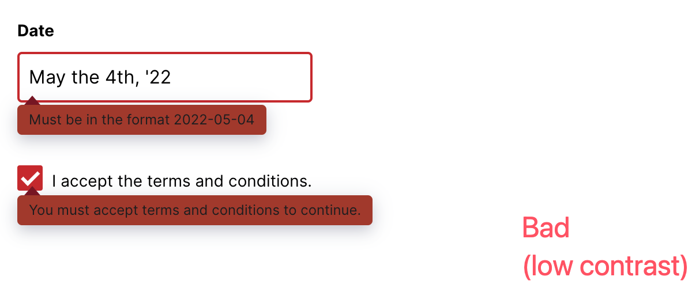

# mono-repo

## Install PNPM

```sh
npm install -g pnpm
```

## Init Mono Repo

```sh
mkdir mono-repo && \
cd mono-repo && \
echo "node_modules\ndist\n.DS_Store\n.tmp\n" >> .gitignore && \
pnpm init
```

```sh
mkdir lib-web-ui && \
mkdir demo-lib-web-ui && \
mkdir app-next-1 && \
mkdir app-cra-1
```

```sh
touch pnpm-workspace.yaml
```

```yaml
packages:
  - "lib-web-ui"
  - "demo-lib-web-ui"
  - "app-next-*"
  - "app-cra-*"
```

## Add Common Dependencies

```sh
# add the dependencies to the workspace root

pnpm add react react-dom next -w

pnpm add -D typescript -w

pnpm add -D @types/node @types/react @types/react-dom -w

pnpm add -D vite @vitejs/plugin-react vite-plugin-dts -w

pnpm add -D tailwindcss postcss autoprefixer -w
```

## PNPM link workspace

`package.json`:

```diff
  "dependencies": {
    ...
+   "@designgreat/lib-web-ui": "workspace:*"
  },
```

```sh
# link `lib-web-ui` (@designgreat/lib-web-ui) to pnpm-lock.yaml
pnpm install
```

## Init UI Component Library Project

```sh
cd lib-web-ui && \
echo "registry = 'https://registry.npmjs.org/'" >> .npmrc && \
pnpm init
```

`package.json`:

```diff
- "name": "lib-web-ui",
+ "name": "@designgreat/lib-web-ui",
+ "peerDependencies": {
+   "react": "^18.3.1",
+   "react-dom": "^18.3.1"
+ }
```

```sh
pnpm install
# add `importers` -> `lib-web-ui` (@designgreat/lib-web-ui) to pnpm-lock.yaml
```

## Init TailwindCSS

```sh
npx tailwindcss init -p  --esm --ts
```

`tailwind.config.ts`:

```diff
  content: [
+   "./src/**/*.{js,jsx,ts,tsx}",
  ],
```

## Init Files

```sh
# create:
# - source directory `src`
# - entry js (to import and export all components)
# - entry css (to import TailwindCSS directives)
# - a demo component `Button`
# - helper js `_utils/...`
mkdir src && \
mkdir src/button && \
touch src/button/index.tsx && \
mkdir src/_utils && \
touch src/_utils/class-name.ts && \
touch src/index.ts && \
touch src/style.css
```

```js
// src/_utils/class-name.ts
export function classNames(...classes: string[]):string {
  return classes.filter(Boolean).join(' ');
}
```

## Write a Component

```js
import React, { MouseEventHandler } from 'react';

interface ButtonProps {
  type?: 'primary' | 'default' | 'dashed' | 'link';
  disabled?: boolean;
  children: React.ReactNode;
  onClick?: MouseEventHandler<HTMLButtonElement>;
}

const Button: React.FC<ButtonProps> = ({
  type = 'default',
  disabled = false,
  children,
  onClick,
}) => {
  const baseStyles = 'px-4 py-2 rounded focus:outline-none';
  const typeStyles = {
    primary: 'bg-blue-500 text-white hover:bg-blue-700',
    default: 'bg-white border border-gray-300 text-gray-700 hover:bg-gray-100',
    dashed: 'bg-white border-2 border-dashed border-gray-300 text-gray-700 hover:bg-gray-100',
    link: 'bg-transparent text-blue-500 hover:bg-gray-100',
  };
  const disabledStyles = 'opacity-50 cursor-not-allowed';

  const styles = `${baseStyles} ${typeStyles[type]} ${disabled ? disabledStyles : ''}`;

  return (
    <button
      className={styles}
      onClick={disabled ? undefined : onClick}
      disabled={disabled}
    >
      {children}
    </button>
  );
};

export default Button;
```

## Export the Component

```css
/* src/style.css */
@tailwind base;
@tailwind components;
@tailwind utilities;
```

```js
// src/index.ts
import './style.css'; // Import TailwindCSS styles

export { default as Button } from './button';
```

## Build the Library

```sh
touch vite.config.ts
```

```ts
// vite.config.ts
import { defineConfig } from 'vite';
import react from '@vitejs/plugin-react';
import path from 'path';

export default defineConfig({
  build: {
    outDir: path.resolve(__dirname, 'dist'),
    lib: {
      entry: index: path.resolve(__dirname, 'src'),
      name: 'Web UI Library',
      fileName: (format, entryName) => `${entryName}.${format}.js`,
      formats: ['es', 'cjs']
    },
    rollupOptions: { // exclude basic libs (react, react-dom etc.) from building output
      external: ['react', 'react-dom'],
      output: {
        globals: {
          react: 'React',
          'react-dom': 'ReactDOM',
        },
      },
    },
  },
  plugins: [
    react()
  ]
});
```

`package.json`:

```diff
  "scripts": {
    ...
+   "build": "vite build"
  },
```

```sh
npm run build
# check the output of `dist` folder
```

## TypeScript Declarations

Generate TypeScript Declarations

```sh
tsc --init # touch tsconfig.json
```

`tsconfig.json`:

```json
{
  "compilerOptions": {
    "target": "esnext",
    "module": "esnext",
    "jsx": "react-jsx",
    "strict": true,
    "moduleResolution": "node",
    "resolveJsonModule": true,
    "isolatedModules": true,
    "esModuleInterop": true,
    "lib": [
      "dom",
      "dom.iterable",
      "esnext"
    ],
    "skipLibCheck": true,
    "allowSyntheticDefaultImports": true,
    "forceConsistentCasingInFileNames": true,
    "declaration": true,
    "declarationDir": "./dist",
    "outDir": "./dist",
    "baseUrl": "./"
  },
  "include": [
    "src"
  ]
}
```

```sh
pnpm add -D vite-plugin-dts
```

`vite.config.ts`:

```diff
...

+import dts from 'vite-plugin-dts'

...
  plugins: [
    react(),
+   dts({
+     tsconfigPath: path.resolve(__dirname, 'tsconfig.json'),
+     outDir: path.resolve(__dirname, 'dist'),
+     // insertTypesEntry: true
+   })
  ],
```

```sh
npm run build
```

## Write the Demo

```sh
mkdir demo && \
touch demo/index.html && \
touch demo/index.tsx && \
touch demo/index.css && \
mkdir demo/button && \
touch demo/button/index.tsx
```

`demo/index.html`:

```html
<!DOCTYPE html>
<html lang="en">

<head>
  <meta charset="UTF-8" />
  <meta name="viewport" content="width=device-width, initial-scale=1.0" />
  <title>Component Library Demo</title>
</head>

<body>
  <div id="app"></div>
  <script type="module" src="index.tsx"></script>
</body>

</html>
```

```ts
// demo/index.tsx

import React from 'react'
import { createRoot } from 'react-dom/client'

import ButtonDemo from './demo/button'

import './src/index.css' // Import styles from the library

import './index.css' // Import styles specific to Demo Pages

const container = document.getElementById('app') || document.body
const root = createRoot(container)

const App = () => (
  <div>
    <ButtonDemo />
  </div>
)

root.render(<App />)
```

```css
/* demo/index.css */
html {
  background-color: aquamarine;
}
```

```js
// demo/button/index.tsx

import { Button } from '../../src' // Import the Button component from the library

export default () => {
  return (
    <div className="p-4">
      <h1 className="text-2xl font-bold mb-4">Button Library Demo</h1>
      <div className="space-y-4">
        <Button type="primary" onClick={() => alert('Primary Button Clicked')}>
          Primary Button
        </Button>
        <Button type="default" onClick={() => alert('Default Button Clicked')}>
          Default Button
        </Button>
        <Button type="dashed" onClick={() => alert('Dashed Button Clicked')}>
          Dashed Button
        </Button>
        <Button type="link" onClick={() => alert('Link Button Clicked')}>
          Link Button
        </Button>
        <Button type="primary" disabled>
          Disabled Primary Button
        </Button>
        <Button type="default" disabled>
          Disabled Default Button
        </Button>
      </div>

    </div>
  )
}
```

`vite.config.ts`:

```diff
...
export default defineConfig({
+ root: path.resolve(__dirname, 'demo'),
  build: {
    ...
```

`package.json`:

```diff
  "scripts": {
    ...
+   "dev": "vite",
    ...
  },
```

```sh
npm run dev
```

## Write another Component

`lib-web-ui/src/tab/index.tsx`:

```js
// tab/index.tsx
import React, { useState } from 'react'

export type TabProps = {
  label: string;
  children: React.ReactNode;
}

export type TabsProps = {
  children: React.ReactElement<TabProps>[];
}

export const Tab: React.FC<TabProps> = ({ label, children }) => {
  return <div>{children}</div>;
};

export const Tabs: React.FC<TabsProps> = ({ children }) => {
  const [activeTab, setActiveTab] = useState(0);

  return (
    <div>
      <div className="flex cursor-pointer border-b">
        {children.map((tab, index) => (
          <div
            key={index}
            className={`p-4 ${activeTab === index ? 'border-b-2 border-blue-500' : ''}`}
            onClick={() => setActiveTab(index)}
          >
            {tab.props.label}
          </div>
        ))}
      </div>
      <div className="p-4">
        {React.Children.map(children, (child, index) => {
          if (index === activeTab) return child;
          return null;
        })}
      </div>
    </div>
  );
};
```

`lib-web-ui/src/index.tsx`:

```diff
+export { Tab, Tabs } from './tab'
```

## Publish

`package.json`:

```diff
+ "type": "module",
+ "main": "dist/index.cjs.js",
+ "module": "dist/index.es.js",
+ "types": "dist/index.d.ts",
+ "files": [
+   "dist"
+ ],
```

```sh
npm publish # npm publish --access public
```

## Import On Demand - Multiple Entry Points

> we did not import the square method from the src/math.js module. That function is what's known as "dead code", meaning an unused export that should be dropped.

> In webpack, tree shaking works with both ECMAScript modules (ESM) and CommonJS, but it does not work with Asynchronous Module Definition (AMD) or Universal Module Definition (UMD).

```diff
-import { Button } from '@designgreat/lib-web-ui'
+import Button from '@designgreat/lib-web-ui/button'
```

To avoid importing all components in case projects using the library without **tree shaking**.

`vite.config.ts`:

```diff
...
-     entry: path.resolve(__dirname, 'src'),
+     entry: {
+       index: path.resolve(__dirname, 'src'),
+       button: path.resolve(__dirname, 'src/button'),
+       tab: path.resolve(__dirname, 'src/tab')
+     },
...
-     fileName: (format) => `index.${format}.js`,
+     fileName: (format, entryName) => `${entryName}.${format}.js`,
```

```sh
npm run build
```

`package.json`:

```diff
+ "exports": {
+   ".": {
+     "import": "./dist/index.es.js",
+     "require": "./dist/index.cjs.js",
+     "types": "./dist/index.d.ts"
+   },
+   "./style.css": {
+     "import": "./dist/style.css",
+     "require": "./dist/style.css"
+   },
+   "./button": {
+     "import": "./dist/button.es.js",
+     "require": "./dist/button.cjs.js",
+     "types": "./dist/button/index.d.ts"
+   },
+   "./tab": {
+     "import": "./dist/tab.es.js",
+     "require": "./dist/tab.cjs.js",
+     "types": "./dist/tab/index.d.ts"
+   }
+ },
```

```sh
npm publish
```

### TODO: Import styles on demand

## Separate Demo Project

### Demo template

```sh
mkdir scripts &&
touch scripts/get-npm-latest-version.ts &&
mkdir demo-lib-web-ui &&
cd demo-lib-web-ui &&
pnpm init && \
touch vite.config.ts && \
touch tsconfig.json && \
mkdir src && \
touch index.html && \
touch index.tsx && \
touch src/index.css
```

`package.json`:

```diff
  "scripts": {
+   "dev": "vite",
+   "build": "vite build"
  },
```

`tsconfig.json`:

```json
{
  "compilerOptions": {
    "target": "esnext",
    "module": "esnext",
    "jsx": "react-jsx",
    "strict": true,
    "moduleResolution": "node",
    "resolveJsonModule": true,
    "isolatedModules": true,
    "esModuleInterop": true,
    "lib": [
      "dom",
      "dom.iterable",
      "esnext"
    ],
    "skipLibCheck": true,
    "allowSyntheticDefaultImports": true,
    "forceConsistentCasingInFileNames": true,
    "declaration": true,
    "declarationDir": "./dist",
    "outDir": "./dist",
    "baseUrl": "./",
    "paths": {
      "@/*": [
        "src/*"
      ]
    }
  },
  "include": [
    "src",
    "*.tsx"
  ]
}
```

`vite.config.ts`:

```ts
import { defineConfig } from 'vite'
import react from '@vitejs/plugin-react'
import fs from 'fs'
import path from 'path'
import { getLatestVersion } from '../scripts/get-npm-latest-version'

const tempDir = '.tmp'
const intermediateFiles: string[] = []

const pages = getHtmlEntries()

export default defineConfig({
  root: path.resolve(__dirname, tempDir),
  // base: 'https://your-cnd.com', // default: '/'
  plugins: [
    react(),
    generateComponentPages()
  ],
  build: {
    // sourcemap: true,
    rollupOptions: {
      input: pages
    },
    outDir: path.resolve(__dirname, 'dist')
  },
  resolve: { alias: { "@": path.resolve("src") } }
})

const htmlTemplate = fs.readFileSync(path.resolve(__dirname, 'index.html'), 'utf-8')
const tsxTemplate = fs.readFileSync(path.resolve(__dirname, 'index.tsx'), 'utf-8')

function generateComponentPages() {
  return {
    name: 'generate-component-pages',
    config() {

      deletePath(tempDir)

      const componentsDir = path.resolve(__dirname, 'src')
      
      traverseDir(componentsDir, (filePath, relativeDir) => {
        if (filePath.endsWith('.tsx')) {
          const componentName = path.basename(filePath, '.tsx')
          const capitalizedComponentName = capitalizeFirstLetter(componentName)
          const componentPath = `${relativeDir}/${componentName}`

          // Create variation TSX and HTML
          const { jsFilePath, htmlFilePath } = createPageFiles(`${tempDir}/${relativeDir}`, `${componentName}`, capitalizedComponentName, componentPath)
          intermediateFiles.push(jsFilePath, htmlFilePath)
          createPlayGroundProject(componentPath, jsFilePath, htmlFilePath, filePath)
        }
      })

      // Generate list html (index.html) to link all demos
      const listHtmlPath = path.resolve(__dirname, tempDir, 'index.html')
      const listHtmlContent = generateListHtml(componentsDir)
      // console.log('\nlist HTML:\n\n', listHtmlContent)
      fs.writeFileSync(listHtmlPath, listHtmlContent)
      intermediateFiles.push(listHtmlPath)
    },
    async buildEnd() {
      // console.log('\nintermediate files:\n\n', intermediateFiles)
      intermediateFiles.forEach((dir) => {
        deletePath(dir);
      });
      deletePath(tempDir)
    }
  }
}

function createPageFiles(
  relativeDir: string,
  suffix: string,
  componentName: string,
  componentPath: string
) {
  suffix = suffix === 'index' ? suffix : suffix + '/index'

  const randomStr = generateRandomString(5)
  const jsFileId = `${suffix}-${randomStr}`
  const jsFileName = `${relativeDir}/${jsFileId}.tsx`
  const jsFilePath = path.resolve(__dirname, jsFileName)
  ensureDirectoryExistence(jsFilePath)

  // Adjust the component path to be relative to the 'src' directory and use lowercase for the path
  const jsContent = tsxTemplate
    .replace(/import\s+ButtonDemo\s+from\s+['"].*?['"];?\s*/, `import ${componentName} from '@/${componentPath}';\n`)
    .replace(/<ButtonDemo\s*\/>/, `<${componentName} />`)

  fs.writeFileSync(jsFilePath, jsContent)

  // Create the modified HTML content
  const htmlFileName = `${relativeDir}/${suffix}.html`
  const htmlFilePath = path.resolve(__dirname, htmlFileName)
  const htmlContent = htmlTemplate
    .replace('<script type="module" src="index.tsx"></script>', `<script type="module" src="index-${randomStr}.tsx"></script>`)

  ensureDirectoryExistence(htmlFilePath)
  fs.writeFileSync(htmlFilePath, htmlContent)

  return { jsFilePath, htmlFilePath }
}

const playgroundDistDir = 'playground'

async function createPlayGroundProject(
  componentPath: string,
  jsFilePath: string,
  htmlFilePath: string,
  sourceFilePath: string
) {
  let playgroundProjectName:string
  if (componentPath.endsWith('index')) {
    playgroundProjectName = componentPath.split('/')[0]
  } else {
    playgroundProjectName = componentPath.replace('/', '-')
  }
  const playgroundProjectDir = path.resolve(__dirname, playgroundDistDir, 'dist', playgroundProjectName)

  deletePath(playgroundProjectDir)

  const playgroundTemplatePath = path.resolve(__dirname, playgroundDistDir)

  const playgroundPackageJSONTemplate = path.resolve(playgroundTemplatePath, 'package.json')
  const playgroundPackageJSONTartget = path.resolve(playgroundProjectDir, 'package.json')

  const playgroundViteConfigTemplate = path.resolve(playgroundTemplatePath, 'vite.config.ts')
  const playgroundViteConfigTarget = path.resolve(playgroundProjectDir, 'vite.config.ts')

  const playgroundTsConfigTemplate = path.resolve(playgroundTemplatePath, 'tsconfig.json')
  const playgroundTsConfigTarget = path.resolve(playgroundProjectDir, 'tsconfig.json')

  const htmlEntryFileName = path.basename(htmlFilePath)
  const htmlEntryFileTargetPath = path.resolve(playgroundProjectDir, htmlEntryFileName)

  const jsEntryFileName = path.basename(jsFilePath)
  const jsEntryFileTargetPath = path.resolve(playgroundProjectDir, jsEntryFileName)

  const jsSourceFilePath = path.relative(__dirname, sourceFilePath)
  const jsSourceFileTargetPath = path.resolve(playgroundProjectDir, jsSourceFilePath)

  const cssSourceFilePath = path.relative(__dirname, 'src/index.css')
  const cssSourceFileTargetPath = path.resolve(playgroundProjectDir, 'src/index.css')

  // console.log(
  //   '------\n',
  //   componentPath, '\n',
  //   jsFilePath, '\n',
  //   htmlFilePath, '\n',
  //   sourceFilePath, '\n',
  //   htmlEntryFileTargetPath, '\n',
  //   jsEntryFileTargetPath, '\n',
  //   jsSourceFileTargetPath, '\n'
  // )

  ensureDirectoryExistence(htmlEntryFileTargetPath)  
  fs.copyFileSync(htmlFilePath, htmlEntryFileTargetPath)
  ensureDirectoryExistence(jsEntryFileTargetPath)
  fs.copyFileSync(jsFilePath, jsEntryFileTargetPath)
  ensureDirectoryExistence(jsSourceFileTargetPath)
  fs.copyFileSync(sourceFilePath, jsSourceFileTargetPath)
  ensureDirectoryExistence(cssSourceFileTargetPath)
  fs.copyFileSync(cssSourceFilePath, cssSourceFileTargetPath)

  await copyModifyPackageJSON(playgroundPackageJSONTemplate, playgroundPackageJSONTartget)

  fs.copyFileSync(playgroundViteConfigTemplate, playgroundViteConfigTarget)
  fs.copyFileSync(playgroundTsConfigTemplate, playgroundTsConfigTarget)

  generatePlaygroundJs(playgroundProjectDir)
}

async function copyModifyPackageJSON(playgroundPackageJSONTemplate, playgroundPackageJSONTartget) {
  // fs.copyFileSync(playgroundPackageJSONTemplate, playgroundPackageJSONTartget)
  const json = JSON.parse(fs.readFileSync(playgroundPackageJSONTemplate, 'utf-8'))
  const version = await getLatestVersion('@designgreat/ui-component-web')
  // console.log('latest version: ', version)
  json.dependencies['@designgreat/ui-component-web'] = `^${version}`
  fs.writeFileSync(playgroundPackageJSONTartget, JSON.stringify(json, null, 2))
}

function traverseDir(dir: string, callback: (filePath: string, relativeDir: string) => void) {
  fs.readdirSync(dir).forEach((file) => {
    const filePath = path.join(dir, file)
    const stats = fs.statSync(filePath)
    if (stats.isDirectory()) {
      traverseDir(filePath, callback)
    } else if (stats.isFile()) {
      const relativeDir = path.relative(path.resolve(__dirname, 'src'), filePath)
      callback(filePath, path.dirname(relativeDir))
    }
  })
}

function capitalizeFirstLetter(string: string) {
  return string.charAt(0).toUpperCase() + string.slice(1)
}

function getHtmlEntries() {
  const entries: Record<string, string> = {}
  traverseDir(path.resolve(__dirname, 'src'), (filePath, relativeDir) => {
    if (filePath.endsWith('.tsx')) {
      const componentName = path.basename(filePath, '.tsx')
      if (componentName === 'index' || !filePath.endsWith('index.tsx')) {
        const htmlPath = `${relativeDir}/${componentName === 'index' ? 'index' : `${componentName}/index`}`
        // const htmlPath = `${relativeDir}/${componentName}`
        const htmlFileName = `${htmlPath}.html`
        entries[componentName === 'index' ? relativeDir : `${relativeDir}/${componentName}`] = path.resolve(__dirname, tempDir, htmlFileName)
      }
    }
  })
  entries.index = path.resolve(__dirname, tempDir, 'index.html')
  // console.log('\nentries:\n\n', entries)
  return entries
}

function ensureDirectoryExistence(filePath: string) {
  const dirname = path.dirname(filePath)
  if (fs.existsSync(dirname)) {
    return true
  }
  ensureDirectoryExistence(dirname)
  fs.mkdirSync(dirname)
}

function generateListHtml(componentsDir: string) {
  let listHtmlContent = '<!DOCTYPE html><html lang="en"><head><meta charset="UTF-8"/><meta name="viewport" content="width=device-width, initial-scale=1.0"/><title>Component List</title></head><body><h1>Component List</h1><ul>'
  traverseDir(componentsDir, (filePath, relativeDir) => {
    if (filePath.endsWith('.tsx')) {
      const componentName = path.basename(filePath, '.tsx')
      if (componentName !== 'index') {
        // const htmlPath = `${relativeDir}/${componentName}.html`
        const htmlPath = `${relativeDir}/${componentName}/`
        listHtmlContent += `<li><a href="${htmlPath}">${relativeDir}/${componentName}</a></li>`
      } else {
        const htmlPath = `${relativeDir}/`
        listHtmlContent += `<li><a href="${htmlPath}">${relativeDir}</a></li>`
      }
    }
  })
  listHtmlContent += '</ul></body></html>'
  return listHtmlContent
}

function deletePath(filePath: string) {
  if (fs.existsSync(filePath)) {
    if (fs.statSync(filePath).isDirectory()) {
      fs.readdirSync(filePath).forEach((file) => {
        const currentPath = path.join(filePath, file);
        deletePath(currentPath);
      });
      fs.rmdirSync(filePath);
    } else {
      fs.unlinkSync(filePath);
    }
  }
}

function generateRandomString(length) {
  const characters = 'abcdefghijklmnopqrstuvwxyz0123456789';
  let result = '';
  const charactersLength = characters.length;
  for (let i = 0; i < length; i++) {
      result += characters.charAt(Math.floor(Math.random() * charactersLength));
  }
  return result;
}

// Helper function to check if the file is text-based
function isTextFile(filePath) {
  const textExtensions = ['.js', '.html', '.tsx', '.jsx', '.css', '.ts', '.json'];
  return textExtensions.includes(path.extname(filePath));
}

// Recursive function to read all files in the directory
function readFiles(folder) {

  function readFilesRecursively(dir, fileContents = {}) {
    const files = fs.readdirSync(dir);

    files.forEach(file => {
      const fullPath = path.join(dir, file);
      const relativePath = path.relative(folder, fullPath);

      if (fs.statSync(fullPath).isDirectory()) {
        readFilesRecursively(fullPath, fileContents);
      } else if (isTextFile(fullPath)) {
        try {
          const content = fs.readFileSync(fullPath, 'utf8');
          fileContents[relativePath] = content;
        } catch (err) {
          console.error(`Error reading file: ${relativePath}`, err);
        }
      }
    });

    return fileContents;
  }

  return readFilesRecursively(folder)
}

// Main function to write JSON into playground.js
function generatePlaygroundJs(directory) {
  const fileContents = readFiles(directory);
  // const output = `const fileContents = ${JSON.stringify(fileContents, null, 2)};\n\nexport default fileContents;\n`;

  const packageJson = JSON.parse(fileContents['package.json'])

  const output = `
import sdk from 'https://unpkg.com/@stackblitz/sdk@1/bundles/sdk.m.js';

sdk.embedProject(
  'embed', // document.body
  {
    title: 'React Starter',
    description: 'A basic React project',
    template: 'node',
    dependencies: ${JSON.stringify({
      ...packageJson.dependencies,
      ...packageJson.devDependencies
    }, null, 2)},
    files: ${JSON.stringify(fileContents,null, 2)},
  },
  {
    clickToLoad: true,
    openFile: 'index.html',
    terminalHeight: 50,
  },
)
`

  fs.writeFileSync(path.join(directory, 'stackblitz-sdk.js'), output, 'utf8');
  // console.log('playground js has been generated.');
}

```

`/scripts/get-npm-latest-version.ts`:

```ts
const https = require('https');

function fetchPackageInfo(packageName: string): Promise<{version: string}> {
  const url = `https://registry.npmjs.org/${packageName}/latest`;

  return new Promise((resolve, reject) => {
    https.get(url, (res) => {
      let data = '';

      // A chunk of data has been received.
      res.on('data', (chunk) => {
        data += chunk;
      });

      // The whole response has been received.
      res.on('end', () => {
        if (res.statusCode === 200) {
          try {
            const jsonResponse = JSON.parse(data);
            resolve(jsonResponse);
          } catch (error) {
            reject(new Error('Error parsing response'));
          }
        } else if (res.statusCode === 404) {
          reject(new Error(`Package "${packageName}" not found.`));
        } else {
          reject(new Error(`Failed to retrieve data. Status code: ${res.statusCode}`));
        }
      });
    }).on('error', (err) => {
      reject(new Error(`Error fetching the package: ${err.message}`));
    });
  });
}

export async function getLatestVersion(packageName): Promise<string | undefined> {
  try {
    const packageInfo = await fetchPackageInfo(packageName);
    console.log(`The latest version of ${packageName} is: ${packageInfo.version}`);
    return packageInfo.version
  } catch (error) {
    console.error(error.message);
  }
}

// // Example usage
// const packageName = process.argv[2];
// if (packageName) {
//   getLatestVersion(packageName);
// } else {
//   console.error('Please provide a package name as an argument.');
// }

```

`index.html`:

```html
<!DOCTYPE html>
<html lang="en">

<head>
  <meta charset="UTF-8" />
  <meta name="viewport" content="width=device-width, initial-scale=1.0" />
  <title>Component Library Demo</title>
</head>

<body>
  <div id="app"></div>
  <script type="module" src="index.tsx"></script>
</body>

</html>
```

`index.tsx`:

```tsx
import '@/index.css'
import '@designgreat/lib-web-ui/style.css' // Import the CSS from the library

import React from 'react'
import { createRoot } from 'react-dom/client'

import ButtonDemo from '@/button'
// import OtherDemo from './other-path'
// ...


const container = document.getElementById('app') || document.body
const root = createRoot(container)

const App = () => (
  <div className="p-4">

    <ButtonDemo />

    {/*
      <OtherDemo />
      ...
    */}

  </div>
);

root.render(<App />)

```

`src/index.css`:

```css
html {
  background-color: aquamarine;
}
```

### Entry files for Each Component and their Variations

```txt
├── src
│   ├── index.css
│   │
│   ├── button
│   │   ├── index.tsx
│   │   └── variation1.tsx
│   │
│   ├── other-component
│   │   ├── index.tsx
│   │   ├── variation1.tsx
│   │   └── variation2.tsx
│   │
│   └── tab
│       └── index.tsx
│
├── index.html
├── index.tsx
│
├── package.json
│
└── vite.config.ts
```

`src/button/index.tsx`:

```tsx
import React from 'react';

import Button from '@designgreat/lib-web-ui/button'; // Import the Button component from the library
// import { Button }  from '@designgreat/lib-web-ui'; // Import the Button component in another way

export default function Demo() {
  return (
    <>
      <h2 className="text-2xl font-bold mb-4">Button Component Demo</h2>

      <div className="space-y-4">

        <Button type="default" onClick={() => alert('Default Button Clicked')}>
          Default Button
        </Button>

        <Button type="primary" onClick={() => alert('Primary Button Clicked')}>
          Primary Button
        </Button>
        
        <Button type="dashed" onClick={() => alert('Dashed Button Clicked')}>
          Dashed Button
        </Button>

        <Button type="link" onClick={() => alert('Link Button Clicked')}>
          Link Button
        </Button>
        <Button type="primary" disabled>
          Disabled Primary Button
        </Button>
        <Button type="default" disabled>
          Disabled Default Button
        </Button>
      </div>
    </>
  )
}
```

`src/button/variation1.tsx`:

```tsx
import React from 'react';

import Button from '@designgreat/lib-web-ui/button'

export default function Demo() {
  return (
    <>
      <h2 className="text-2xl font-bold mb-4">Primary Button Component Demo</h2>

      <div className="space-y-4">
        <Button type="primary" onClick={() => alert('Primary Button Clicked')}>
          Primary Button
        </Button>
      </div>
    </>
  )
}
```

`src/tab/index.tsx`:

```tsx
import React from 'react';

import { Tabs, Tab } from '@designgreat/lib-web-ui'; // Import Tab component

export default function Demo() {
  return (
    <>
      <h2>Tab Component Demo</h2>

      <Tabs>
        <Tab label="Tab 1" a="f">
          <div>Content of Tab 13</div>
        </Tab>
        <Tab label="Tab 2">
          <div>Content of Tab 21</div>
        </Tab>
        <Tab label="Tab 3">
          <div>Content of Tab 3</div>
        </Tab>
      </Tabs>
    </>
  )
}
```

```sh
npm run dev
```

Visit <http://localhost:5173/>

```sh
npm run build
```

### playground dir

```sh
mkdir playground && \
touch playground/package.json && \
touch playground/tsconfig.json && \
touch playground/vite.config.ts
```

`playground/package.json`:

```json
{
  "name": "lib-web-ui-demo",
  "version": "1.0.0",
  "description": "",
  "main": "index.html",
  "scripts": {
    "start": "vite",
    "test": "echo \"Error: no test specified\" && exit 1",
    "dev": "vite",
    "build": "vite build"
  },
  "keywords": [],
  "author": "",
  "license": "ISC",
  "dependencies": {
    "react": "^18.3.1",
    "react-dom": "^18.3.1",
    "@designgreat/lib-web-ui": "^1.0.0"
  },
  "devDependencies": {
    "@types/node": "^20.14.9",
    "@types/react": "^18.3.3",
    "@types/react-dom": "^18.3.0",
    "@vitejs/plugin-react": "^4.3.1",
    "vite": "^5.3.1",
    "typescript": "^5.5.2"
  },
  "stackblitz": {
    "installDependencies": true,
    "startCommand": "npm start"
  }
}
```

`playground/tsconfig.json`:

```json
{
  "compilerOptions": {
    "target": "esnext",
    "module": "esnext",
    "jsx": "react-jsx",
    "strict": true,
    "moduleResolution": "node",
    "resolveJsonModule": true,
    "isolatedModules": true,
    "esModuleInterop": true,
    "lib": [
      "dom",
      "dom.iterable",
      "esnext"
    ],
    "skipLibCheck": true,
    "allowSyntheticDefaultImports": true,
    "forceConsistentCasingInFileNames": true,
    "declaration": true,
    "declarationDir": "./dist",
    "outDir": "./dist",
    "baseUrl": "./",
    "paths": {
      "@/*": [
        "src/*"
      ]
    }
  },
  "include": [
    "src",
    "*.tsx"
  ]
}
```

`playground/vite.config.ts`:

```ts
import { defineConfig } from 'vite'
import react from '@vitejs/plugin-react'
import path from 'path'

export default defineConfig({
  plugins: [
    react()
  ],
  resolve: { alias: { "@": path.resolve("src") } }
})
```

### Optional: Watch src code change

`vite.config.ts`:

```diff
export default defineConfig({
+ resolve: {
+   alias: {
+     '@designgreat/lib-web-ui': path.resolve(__dirname, '../lib-web-ui/src'),
+     '@designgreat/lib-web-ui/index.css': path.resolve(__dirname, '../lib-web-ui/src/index.css'),
+     '@designgreat/lib-web-ui/button': path.resolve(__dirname, '../lib-web-ui/src/button')
+   },
  },
```

Init TailwindCSS:

```sh
npx tailwindcss init -p  --esm --ts
```

`tailwind.config.ts`:

```diff
...
+import libBaseTailwindConfig from '../lib-web-ui/tailwind.config'
...
const config: Config = {
+ ...libBaseTailwindConfig
  content: [
    ...
+   "../lib-web-ui/src/**/*.{js,jsx,ts,tsx}"
  ],
```

## Import Lib in CRA (create-react-app) Project

> CRA: create-react-app <https://create-react-app.dev/>

```sh
pnpm create react-app app-cra-1 && \
cd app-cra-1
```

`app-cra-1/package.json`:

```diff
  "dependencies": {
    ...
-   "react": "^18.3.1",
-   "react-dom": "^18.3.1"
  },
```

```js
// index.js
import '@designgreat/lib-web-ui/style.css'
```

```js
// app.js
import { Button } from '@designgreat/lib-web-ui'
// import Button  from '@designgreat/lib-web-ui/button' // alternative import
// ... <Button>click</Button>
```

```sh
npm start
```

## Import Lib in Next.js Project

Initiate a `Next.js` project with TS, TailwinCSS

`app-next-js-a/package.json`:

```diff
  "dependencies": {
-   "react": "^18",
-   "react-dom": "^18"
  },
  "devDependencies": {
-   "typescript": "^5",
-   "@types/node": "^20",
-   "@types/react": "^18",
-   "@types/react-dom": "^18",
-   "postcss": "^8",
-   "tailwindcss": "^3.4.1"
  }
```

## Watch src Change in Next.js Projects

Add the source path of `lib-web-ui` to the `Next.js` project's TailwindCSS configuration file `tailwind.config.ts`:

> The `content` section of your `tailwind.config.ts` file is where you configure the paths to all of your HTML templates, JavaScript components, and any other source files that contain Tailwind class names.

```diff
...
+import libBaseTailwindConfig from '../lib-web-ui/tailwind.config'
...
const config: Config = {
+ ...libBaseTailwindConfig // optimise this by deep merge
  content: [
    ...
+   "../lib-web-ui/src/**/*.{js,jsx,ts,tsx}"
  ],
```

By default, `Next.js` looks for the module `@designgreat/lib-web-ui` from `lib-web-ui/dist` which is specified in the `main` field of `@designgreat/lib-web-ui`'s package.json.

So, we need to configure module alias in `next.config.mjs` to resolve the module `@designgreat/lib-web-ui` from the library source folder `src`:

```js
const nextConfig = {
  experimental: {
    // for `next dev --turbo`
    // not work for `next build`
    turbo: {
      resolveAlias: {
        '@designgreat/lib-web-ui': '../lib-web-ui/src',
        '@designgreat/lib-web-ui/button': '../lib-web-ui/src/button'
      },
    },
  },
  // for `next dev`
  // and for `next build`
  webpack: (config) => {
    config.resolve.alias['@designgreat/lib-web-ui'] = path.resolve(__dirname, '../lib-web-ui/src')
    config.resolve.alias['@designgreat/lib-web-ui/button'] = path.resolve(__dirname, '../lib-web-ui/src/button')
    return config;
  },
};
```

This also enables `Next.js` to watch the changes of `lib-web-ui/src` while developing.

Also, configure `tsconfig.json` to resolve modules correctly:

```diff
  "compilerOptions": {
    ...
    "paths": {
      ...
+     "@designgreat/lib-web-ui": [
+       "../lib-web-ui/src"
+     ],
+     "@designgreat/lib-web-ui/button": [
+       "../lib-web-ui/src/button"
+     ]
      ...
    }
```

## Documentation

### Essential Parts

`README.md`:

- Introduction
- Usage
  - Basic Examples / Variations
  - With Code snippets
  - With explanations
  - Advanced usage scenarios
  - Live code editor - CodeSandbox / StackBlitz
- API
  - Props
  - Styling
    - Color
    - Sizes
    - CSS Classes
- Design Token ??
- Accessibility
- FAQs?
- Contributing?
- License?

### Document Generation

- build docs website from folder structure
  - sidebar structure
  - MDX
  - Creating projects with the SDK (stackblitz)

### Use Docusaurus

```sh
pnpm create docusaurus doc-lib-web-ui classic --typescript
```

`doc-lib-web-ui/package.json`:

```diff
  "dependencies": {
    ...
-   "react": "^18.0.0",
-   "react-dom": "^18.0.0"
  },
  "devDependencies": {
    ...
-   "typescript": "~5.2.2"
  }
```

`pnpm-workspace.yaml`:

```diff
+- "doc-lib-web-ui"
```

```sh
pnpm install
```

```sh
cd doc-lib-web-ui && \
pnpm start
```

Add code below to `doc-lib-web-ui/docs/tutorial-basics/create-a-document.md`:

```tsx
import Button  from '@designgreat/lib-web-ui/button'; // Import the Button component from the library
import '@designgreat/lib-web-ui/style.css' // Import the CSS from the library

<div className="space-y-4">
  <Button type="primary" onClick={() => alert('Primary Button Clicked')}>
    Primary Button
  </Button>
  <Button type="default" onClick={() => alert('Default Button Clicked')}>
    Default Button
  </Button>
  <Button type="dashed" onClick={() => alert('Dashed Button Clicked')}>
    Dashed Button
  </Button>
  <Button type="link" onClick={() => alert('Link Button Clicked')}>
    Link Button
  </Button>
  <Button type="primary" disabled>
    Disabled Primary Button
  </Button>
  <Button type="default" disabled>
    Disabled Default Button
  </Button>
</div>
```

`docusaurus.config.ts`:

```diff
+  url: 'https://graezykev.github.io',
+  baseUrl: '/design-system', // For GitHub pages deployment, it is often '/<projectName>/'
+  organizationName: 'graezykev', // Usually your GitHub org/user name.
+  projectName: 'design-system', // Usually your repo name.
```

```sh
npm run build
```

```sh
npm run serve
```

Creat GitHub repository named `design-system`

Generate new SSH key (Mac):

```sh
ssh-keygen -t ed25519 -C "your_github_account_email@example.com"
```

```sh
cat ~/.ssh/id_ed25519.pub
```

Add a new SSH key to your GitHub accoun: GitHub -> Settings -> SSH and GPG keys -> New SSH key -> Paste key from the last step

```sh
GIT_USER=graezykev USE_SSH=true npm run deploy
```

Go to GitHub repository `design-system`:

Settings -> Pages -> Build and deployment -> Source -> Deploy from a branch -> Branch -> `gh-pages`

Visit <https://graezykev.github.io/design-system/>

## Playground

### Automatic Script

Read all text files under the demo folder

Get all the path names & text contents into a JSON with the format below:

```json
{
  files: {
    'path/to/file1.js': 'the file content',
    'path/to/file2.json': 'the file content',
    'path/to/file3.tsx': 'the file content',
    'other path': 'the file content'
  }
}
```

Translate the JSON to `a HTML form element` / `some JS code` according to the Stackblitz SDK

Insert the form/code to the corresponding MDX file

Watch the file changes and make the equivalent change to the MDX file

## Design Token

### What

> This specification was published by the Design Tokens Community Group. It is not a W3C Standard nor is it on the W3C Standards Track. <https://tr.designtokens.org/format/#sotd>
> Design tokens are a community movement.

<https://www.youtube.com/watch?v=wtTstdiBuUk>

They help establish a **common vocabulary** (platform-agnostic) across organisations like Designer, Developer(Web, Native App, React Native etc.), PM etc.

- Simply put, design token is A protocol, A Design Language, to translate Design to Development.
  - nicknames
    - Designers "choose" and Developers "use"

A (Design) Token is an information associated with a name, at minimum a **name/value** pair.

For example:

```css
color-text-primary: #000000;
font-size-heading-level-1: 44px;
```

- Manintain high consistency across product UI.
  - update (the value of the nickname)

- Compartmentalise
  - global token / atomic token
  - alias/semantic token

### Categary & Type

- Categary & Type
  - Color
    - font
    - background
    - border
    - outline
  - Size/dimension
    - font
    - width
    - height
    - border radius
  - Duration/Time
  - Number
    - line height
    - z index
  - Font Family
  - Font Weight
  - Font Style?
  - Cubic Bézier
  - Asset/File/Path/URL
    - fonts
    - svgs
    - icon fonts
  - others
- Composite Types
  - typography
    - Font Family
    - Font Size
    - Font Weight
    - Line Height
    - vertical align
    - Letter Spacing / Word Spacing
    - Text Color
    - Text Alignment
    - Text Decoration
    - Text Transform
    - Whitespace
    - word break
    - Margins / Paddings
    - text overflow
    - line clamp
    - text shadow
  - space
  - grid / layout
  - bg
  - border
    - width
    - style
    - color
  - box shadow
  - icon

### Design Token Structure

```js
const REM = 16

const Font_Family_Fallback = 'sans-serif'

const Font_Size_Base = REM // 16
const Font_Size_Medium_Small = Font_Size_Base * .875 // 12
const Font_Size_Small = Font_Size_Base * .75 // 12
const Font_Size_Heading1 = Font_Size_Base * 2.75 // 44
// Font_Size_Heading2~6 ...

const Font_Weight_Normal = 400
const Font_Weight_Bold = 700

const Text_Color_Base = '#000000'
const Background_Color_Base = '#FFFFFF'

const StyleDictionary = {
  color: {
    text: {
      base: {
        value: Text_Color_Base
      },
      link: { // LVHA
        link: {},
        visited: {},
        hover: {},
        active: {}
      }
    },
    decoration: {
      text: {
        base: {
        }
      }
    },
    background: {
      base: {
        value: Background_Color_Base
      },
      button: {
        primary: {
          hover: {},
          focus: {},
          active: {},
          disabled: {}
        }
      }
    },
    border: {},
    shadow: {
      text: {
        x: {},
        y: {}
      },
      box: {
        x: {},
        y: {}
      }
    }
  },
  size: {
    font: {
      base: {
        value: Font_Size_Base
      },
      paragraph: {
        value: Font_Size_Base
      },
      heading1: {
        value: Font_Size_Heading1
      },
      heading2: {}
    },
    height: {
      line: {
        base: {
          value: 1.15
        },
        paragragh: {
          value: 1.5
        },
        paragraghSparse: {
          value: 1.7
        },
        elementary: {
          value: 1
        },
        heading: {
          value: 1.2
        }
      },
      box: {}
    },
    width: {
      box: {},
      border: {},
      outline: {}
    },
    radius: {
      border: {}
    },
    thickness: {
      decoration: {
        text: {
          base: {
            value: 'auto' // default
          },
          fixed5: {
            value: 5 // px
          }
        }
      }
    },
    spacing: {
      letter: {
        base: {
          value: 'normal'
        }
      },
      word: {
        base: {
          value: 'normal'
        }
      },
      indent: {
        base: {
          value: 0
        }
      },
      margin: {},
      padding: {},
      position: {
        left: {},
        top: {},
        right: {},
        bottom: {},
        z: {}
      },
      offset: {
        outline: {
          value: 1
        },
        shadow: {
          text: {
            x: {},
            y: {},
            blurRadius: {}
          },
          box: {
            x: {},
            y: {},
            blurRadius: {},
            spreadRadius: {}
          }
        }
      }
    },
    lineClamp: {
      base: {
        value: 'none'
      },
      singleLine: {
        value: 1
      }
    },
    flexGrow: {
      base: {
        value: 0 // default
      }
    },
    flexShrink: {
      base: {
        value: 1 // default
      }
    },
    translate: {
      transform: {
        x: {},
        y: {},
        z: {},
        '3d': {}
      }
    },
    scale: {
      transform: {
        x: {
          base: {
            value: 1
          }
        },
        y: {},
        z: {},
        '3d': {}
      }
    },
    rotate: {
      transform: {
        x: {
          base: {
            value: '0deg'
          }
        },
        y: {},
        z: {},
        '3d': {}
      }
    },
    skew: {
      transform: {
        x: {
          base: {
            value: '0deg'
          }
        },
        y: {}
      }
    },
    perspective: {
      transform: {
        base: {
          value: 'none'
        }
      }
    },
    matrix: {
      transform: {
        a: {}, b: {}, c: {}, d: {}, tx: {}, ty: {}
      }
    }
  },
  fontFace: {
    base: {
      value: Font_Family_Fallback
    },
    Latin: {},
    zh_Hans: {},
    zh_Hans_SG: {},
    zh_Hant: {},
    zh_Hant_HK: {},
    zh_Hant_TW: {},
    Arabic: {},
    zh: {},
    Greek: {},
    Vietnamese: {},
    Hebrew: {}
  },
  fontFamily: {
    base: {
      value: Font_Family_Fallback
    },
    paragraph: {}
  },
  fontWeight: {
    base: {
      value: Font_Weight_Normal
    },
    bold: {
      value: Font_Weight_Bold
    }
  },
  textTransform: {
    base: {
      value: none // uppercase lowercase capitalize
    }
  },
  fontStretch: {
    base: {
      value: 'normal' // normal=100% condensed=75% expanded=125% ultra-expanded=200%
    }
  },
  align: {
    text: {
      horizontal: {
        centered: {
          value: 'center'
        }
      },
      vertical: {
        base: {
          value: 'baseline'
        },
        middle: {
          value: 'middle'
        },
        Superscript: {
          value: 'supper'
        },
        subscript: {
          value: 'sub'
        }
      }
    },
    box: {
      container: {
        mainAxis: { // justify-content
          // flex-start flex-end space-around space-between
          centered: {
            value: 'center'
          }
        },
        crossAxis: {
          nowrap: { // align-items
            // flex-start flex-end stretch baseline
            centered: {
              value: 'center'
            }
          },
          wrap: { // align-content
            // flex-start flex-end space-around space-between stretch
            centered: {
              value: 'center'
            }
          }
        }
      },
      items: { // align-self -- overrides --> align-items
        centered: {
          value: 'center'
        }
      }
    }
  },
  wordBreak: {
    base: {
      value: 'normal'
    },
    breakAll: {
      value: 'break-all'
    },
    breakWord: {
      value: 'break-word'
    }
  },
  whiteSpace: {
    base: {
      value: 'normal'
    },
    singleLine: {
      value: 'nowrap'
    },
    preserved: {
      value: 'pre'
    }
  },
  style: {
    font: {
      base: {
        value: 'normal'
      },
      annotation: {
        value: 'italic'
      },
      special: {
        value: 'oblique'
      }
    },
    border: {
      base: {
        value: 'solid'
      }
    },
    outline: {
      base: {
        value: 'none'
      }
    },
    decoration: {
      text: {
        underline: {
          value: 'solid'
        }
      }
    },
    list: {
      value: 'disc' // none circle square upper-roman lower-alpha
    }
  },
  position: {
    box: {},
    listStyle: {
      value: 'outside' // inside
    },
    line: {
      decoration: {
        text: {
          base: {
            value: 'none'
          },
          overline: {},
          underline: {},
          lineThrough: {
            value: 'line-through'
          }
        }
      }
    },
  },
  overflow: {
    box: {},
    text: {
      base: {
        value: 'ellipsis'
      },
      ellipsis: {
        value: 'ellipsis'
      }
    }
  },
  transition: {},
  asset: {}
}

const ellipsisWithLineClamp = (num) => {
  'text-overflow': 'ellipsis',
  overflow: 'hidden',
  'white-space': num <= 1 ? 'nowrap' : 'normal',
  display: '-webkit-box', // must
  '-webkit-line-clamp': num, // must
  '-webkit-box-orient': 'vertical' // must
}
```

### Translation Tools

Create a separate Figma file for your design tokens <https://diez.org/getting-started/figma.html>

#### Style Dictionary

```sh
mkdir design-tokens
```

`/pnpm-workspace.yaml`:

```diff
packages:
  ...
+ - "design-tokens"
```

```sh
cd design-tokens && \
npx style-dictionary@4.2.0 init complete
```

`design-tokens/package.json`:

```diff
- "name": "style-dictionary-example-complete",
- "name": "design-tokens",
  ...
- "devDependencies": {
-   "style-dictionary": "..."
- }
```

`/package.json`:

```diff
"dependencies": {
+   "design-tokens": "workspace:*",
```

```sh
cd .. && \
pnpm install
```

```sh
cd design-tokens && \
rm -rf node_modules && \
pnpm add -D style-dictionary@^4.2.0 -w
```

<!-- rm -rf android ios README.md StyleDictionary.podspec LICENSE package.json -->

Use js because it's more programmable and extensible.

```sh
mkdir build && \
touch build/index.js && \
mv config.json build/sd.config.js # touch sd.config.js
```

`package.json`:

```diff
  "scripts": {
-   "build": "style-dictionary build",
+   "build": "node build/index.js",
```

`build/sd.config.js`:

```js
export default function getStyleDictionaryConfig() {
  return {
    "source": ["tokens/**/*.json"],
    "platforms": {
      "css": {
        "transforms": ['attribute/cti', 'name/kebab', 'time/seconds', 'html/icon', 'size/rem', 'color/css', 'asset/url', 'fontFamily/css', 'cubicBezier/css', 'strokeStyle/css/shorthand', 'border/css/shorthand', 'typography/css/shorthand', 'transition/css/shorthand', 'shadow/css/shorthand'],
        "buildPath": "css/",
        "prefix": "token",
        "files": [
          {
            "destination": "variables.scss",
            "format": "scss/variables",
            // "options": {
            //   "outputReferences": true
            // }
          },
          {
            "destination": "variables.css",
            "format": "css/variables",
            // "options": {
            //   "outputReferences": true
            // }
          }
        ],
        "actions": ["copy_assets"]
      },
      "jsts": {
        "transforms": ['attribute/cti', 'name/pascal', 'size/rem', 'color/css'],
        "buildPath": "jsts/",
        "files": [
          {
            "destination": "variables.js",
            "format": "javascript/esm"
          },
          {
            "format": "typescript/module-declarations",
            "destination": "variables.d.ts"
          }
        ]
      },
      "ios": {
        "transforms": ['attribute/cti', 'name/pascal', 'color/UIColor', 'content/objC/literal', 'asset/objC/literal', 'size/remToPt'],
        "buildPath": "ios/Classes/Generated/",
        "prefix": "StyleDictionary",
        "files": [
          {
            "destination": "StyleDictionarySize.h",
            "format": "ios/static.h",
            "options": {
              "className": "StyleDictionarySize",
              "type": "float"
            },
            "filter": {
              "attributes": {
                "category": "size"
              }
            }
          },
          {
            "destination": "StyleDictionarySize.m",
            "format": "ios/static.m",
            "options": {
              "className": "StyleDictionarySize",
              "type": "float"
            },
            "filter": {
              "attributes": {
                "category": "size"
              }
            }
          },
          {
            "destination": "StyleDictionaryIcons.h",
            "format": "ios/strings.h",
            "options": {
              "className": "StyleDictionaryIcons"
            },
            "filter": {
              "attributes": {
                "category": "content",
                "type": "icon"
              }
            }
          },
          {
            "destination": "StyleDictionaryIcons.m",
            "format": "ios/strings.m",
            "options": {
              "className": "StyleDictionaryIcons"
            },
            "filter": {
              "attributes": {
                "category": "content",
                "type": "icon"
              }
            }
          },
          {
            "destination": "StyleDictionaryColor.h",
            "format": "ios/colors.h",
            "options": {
              "className": "StyleDictionaryColor",
              "type": "StyleDictionaryColorName"
            },
            "filter": {
              "attributes": {
                "category": "color"
              }
            }
          },
          {
            "destination": "StyleDictionaryColor.m",
            "format": "ios/colors.m",
            "options": {
              "className": "StyleDictionaryColor",
              "type": "StyleDictionaryColorName"
            },
            "filter": {
              "attributes": {
                "category": "color"
              }
            }
          },
          {
            "destination": "StyleDictionaryProperties.h",
            "format": "ios/singleton.h",
            "options": {
              "className": "StyleDictionaryProperties"
            }
          },
          {
            "destination": "StyleDictionaryProperties.m",
            "format": "ios/singleton.m",
            "options": {
              "className": "StyleDictionaryProperties"
            }
          }
        ]
      },

      "android": {
        "transforms": ['attribute/cti', 'name/snake', 'color/hex8android', 'size/remToSp', 'size/remToDp'],
        "buildPath": "android/styledictionary/src/main/res/values/",
        "files": [
          {
            "destination": "style_dictionary_colors.xml",
            "format": "android/colors"
          },
          {
            "destination": "style_dictionary_font_dimens.xml",
            "format": "android/fontDimens"
          },
          {
            "destination": "style_dictionary_dimens.xml",
            "format": "android/dimens"
          },
          {
            "destination": "style_dictionary_integers.xml",
            "format": "android/integers"
          },
          {
            "destination": "style_dictionary_strings.xml",
            "format": "android/strings"
          }
        ]
      },

      "android-asset": {
        "transforms": ['attribute/cti', 'name/snake', 'color/hex8android', 'size/remToSp', 'size/remToDp'],
        "buildPath": "android/styledictionary/src/main/",
        "files": [
          {
            "destination": "assets/data/properties.json",
            "format": "json"
          }
        ],
        "actions": ["copy_assets"]
      }
    }
  }
})

```

`build/index.js`:

```js
import StyleDictionary from 'style-dictionary'
import getStyleDictionaryConfig from './sd.config.js'

const sd = new StyleDictionary(getStyleDictionaryConfig())
sd.buildAllPlatforms()

// ['css', 'jsts', 'ios', 'android', 'android-asset'].map((platform) => {
//   sd.buildPlatform(platform)
// })

```

```sh
npm run build
# npx style-dictionary@4.2.0 build --config ./sd.config.js
```

##### Create 1st Design Token

```sh
rm -rf tokens && \
mkdir tokens && \
mkdir tokens/color
```

```sh
touch tokens/color/base.js
```

Use js to because it's more programmable and extensible.

`tokens/color/base.js`:

```js
export default {
  color: {
    base: {
      "white": { "value": "white", "type": "color" },
      "black": { "value": "#000000", "type": "color" }
    }
  }
}
```

Edit `sd.config.js`:

```diff
- "source": ["tokens/**/*.json"],
+ "source": ["tokens/**/*.json", "tokens/**/*.js"],
```

```sh
npm run build
```

##### Add Colors with HSL, RGBA, HSV

```diff
export default {
  color: {
    base: {
      ...
+     "red": { "value": "hsl(0, 100%, 50%)", "type": "color" },
+     "green": { "value": "#00ff00", "type": "color" },
+     "blue": { "value": "hsv(240, 100%, 100%)", "type": "color" },
+     "blue-transparent-50": { "value": "rgba(0, 0, 255, 50%)", "type": "color" },
+     "red-transparent-50": { "value": "#ff000080", "type": "color" },
```

`sd.config.js`:

```diff
    "jsts": {
-     "transformGroup": "js",
+     // "transformGroup": "js", // ['attribute/cti', 'name/pascal', 'size/rem', 'color/hex'],
+     "transforms": ['attribute/cti', 'name/pascal', 'size/rem', 'color/css'],
```

```sh
npm run build
```

## Design Token - Color

### Color Palette / Global Colors

#### Base Colors

```sh
rm tokens/color/base.js && \
touch tokens/color/base/saturated.js && \
touch tokens/color/base/grey.js
```

##### Saturated Colors

`tokens/color/base/saturated.js`:

```js
export default {
  color: {
    base: {
      "red": { "value": "#AE2E24", "type": "color" },
      "orange": { "value": "#A54800", "type": "color" },
      "yellow": { "value": "#7F5F01", "type": "color" },
      "green": { "value": "#216E4E", "type": "color" },
      "teal": { "value": "#206A83", "type": "color" },
      "blue": { "value": "#0055CC", "type": "color" },
      "purple": { "value": "#5E4DB2", "type": "color" },
      "magenta": { "value": "#943D73", "type": "color" },
      "lime": { "value": "#4C6B1F", "type": "color" }
    }
  }

}
```

##### Grey Color

`tokens/color/base/grey.js`:

```js
export default {
  color: {
    base: {
      "grey": { "value": "#1d1d1f", "type": "color" }
    }
  }
}

```

#### Derived Colors

##### Accents

Derive from base colors.

Different shades and/or Tints of the base color.

Shades and tints are variations of a base color.

Shades are created by adding black to a base color, making it darker. For example:

Base color (Primary Blue): #0052CC

Shade: #003399 (adds depth and can be used for shadows or more somber design elements)

Tints are made by adding white to a base color, making it lighter. For example:

Base color (Primary Blue): #0052CC

Tint: #99CCFF (used for highlights or to give a lighter, softer appearance)

```sh
mkdir tokens/color/accent && \
touch touch tokens/color/accent/blue.js
```

`tokens/color/accent/blue.js`:

```js
export default {
  color: {
    accent: {
      "blue": { // https://mdigi.tools/color-shades/#0055cc
        "1": { "value": "#e5f0ff", "type": "color" },
        "2": { "value": "#b7d5ff", "type": "color" },
        "3": { "value": "#88baff", "type": "color" },
        "4": { "value": "#599eff", "type": "color" },
        "5": { "value": "#2a83ff", "type": "color" },
        "6": { "value": "#0068fb", "type": "color" },
        "7": { "value": "{color.base.blue}", "type": "color" },
        "8": { "value": "#003c90", "type": "color" },
        "9": { "value": "#002355", "type": "color" },
        "10":{ "value": "#000b19", "type": "color" },
        "DEFAULT": { "value": "{color.accent.blue.7}", "type": "color" }
      }
    }
  }
}

```

###### Auto-Generate Accent Colors / Color Shades

```sh
pnpm add tinycolor2
```

```sh
mkdir utils && touch utils/color-gradient.js
```

`utils/color-gradient.js`:

```js
import tinycolor2 from 'tinycolor2'

export function generateColorShades(
  name,
  colors,
  totalShades = 10,
  defaultShade = 7,
  darkestLightness = 0.05,
  lightestLightness = 0.95,
) {
  const darkerShades = totalShades - defaultShade
  const lighterShades = defaultShade - 1

  const rst = {}

  const value = colors[name].value
  rst[defaultShade] = value
  rst.DEFAULT = rst[defaultShade]

  const color = tinycolor2(value)

  const hsl = color.toHsl()
  const lightness = hsl.l
  const lightGap = (lightestLightness - lightness) / lighterShades
  const darkGap = (lightness - darkestLightness) / darkerShades

  for (let from = 1; from <= darkerShades; from++) {
    const l = lightness - from * darkGap
    const newColor = tinycolor2(Object.assign({}, hsl, { l }))
    rst[defaultShade + from] = `#${newColor.toHex()}`
  }

  for (let from = 1; from <= lighterShades; from++) {
    const l = lightness + from * lightGap
    const newColor = tinycolor2(Object.assign({}, hsl, { l }))
    rst[defaultShade - from] = `#${newColor.toHex()}`
  }

  return rst
}

```

`tokens/color/accent/blue.js`:

```js
import tokens from '../base/saturated.js'
import { generateColorShades } from '../../../utils/color-gradient.js'

const name = 'blue'
const colors = tokens.color.base

const shades = generateColorShades(name, colors)
// console.log(shades)
const accents = Object.keys(shades).reduce((acc, level) => ({
  ...acc,
  [level]: {
    value: shades[level],
    type: 'color'
  }
}), {})
// console.log(accents)

export default {
  color: {
    accent: {
      [name]: accents
    }
  }
}

```

###### Auto-Generate Accent Colors for Base Colors

```sh
rm tokens/color/accent/blue.js && \
touch tokens/color/accent/saturated.js && \
touch tokens/color/accent/grey.js
```

`tokens/color/accent/saturated.js`:

```js
import tokens from '../base/saturated.js'
import { generateColorShades } from '../../../utils/color-gradient.js'

const colors = tokens.color.base

const accent = Object.keys(colors).reduce((accent, name) => ({
  ...accent,
  [name]: (function () {
    const shades = generateColorShades(name, colors)
    // console.log(shades)
    const accents = Object.keys(shades).reduce((acc, level) => ({
      ...acc,
      [level]: {
        value: shades[level],
        type: 'color'
      }
    }), {})
    return accents
  }())
}), {})

// console.log(accent)

export default {
  color: {
    accent
  }
}

```

`tokens/color/accent/grey.js`:

Slightly diffrent in `totalShades`, `defaultShade`, `darkestLightness` and `lightestLightness`.

```js
import tokens from '../base/grey.js'
import { generateColorShades } from '../../../utils/color-gradient.js'

const name = 'grey'

const colors = tokens.color.base

const shades = generateColorShades(name, colors, 12, 11, 0.05, 1) // make the lightest color white
// console.log(shades)
const accents = Object.keys(shades).reduce((acc, level) => ({
  ...acc,
  [level]: {
    value: shades[level],
    type: 'color'
  }
}), {})
// console.log(accents)

export default {
  color: {
    accent: {
      [name]: accents
    }
  }
}

```

##### Alpha

```sh
mkdir tokens/color/alpha && \
touch tokens/color/alpha/grey.js
```

`tokens/color/alpha/grey.js`:

```js
import tinycolor2 from 'tinycolor2'

import tokens from '../accent/grey.js'

const grey = tinycolor2(tokens.color.accent.grey.DEFAULT.value)

export default {
  color: {
    alpha: {
      grey: {
        "1": { "value": grey.setAlpha(0.03).toHex8String(), "type": "color" }, // "1": { "value": "{color.accent.grey.DEFAULT}", "attributes": { "alpha": 0.03 } "type": "color" }
        "2": { "value": grey.setAlpha(0.06).toHex8String(), "type": "color" }, // "2": { "value": "{color.accent.grey.DEFAULT}", "attributes": { "alpha": 0.06 } "type": "color" }
        "3": { "value": grey.setAlpha(0.14).toHex8String(), "type": "color" }, // "3": { "value": "{color.accent.grey.DEFAULT}", "attributes": { "alpha": 0.14 } "type": "color" }
        "4": { "value": grey.setAlpha(0.31).toHex8String(), "type": "color" }, // "4": { "value": "{color.accent.grey.DEFAULT}", "attributes": { "alpha": 0.31 } "type": "color" }
        "5": { "value": grey.setAlpha(0.49).toHex8String(), "type": "color" } // "5": { "value": "{color.accent.grey.DEFAULT}", "attributes": { "alpha": 0.49 } "type": "color" }
      }
    }
  }
}

```

### Color Significance / Color Roles

#### Brand Colors

Brand Color is widly used in Logos, Trademarks or other elements inculcating the brand’s identity/overall look/feel.

For example, Apple's brand colors are clean and sophisticated. Except for the iconic black and white logo, you'll mainly see **silver**, **space gray**, and **gold** in its products — these exude luxury and high-tech vibes.


Brand Colors are often chosen from Primary Colors or Base Colors from your Color Pallet

For example, we pick Brand color from (the first one of) primary colors (brand colors and primary colors usually overlap each other).

```sh
touch tokens/color/brand.js
```

```js
export default {
  color: {
    brand: {
      value: '{color.primary.1}',
      type: 'color'
    }
  }
}

```

> Color meanings in branding <https://blog.tubikstudio.com/color-in-design-influence-on-users-actions/>
>
> - Red — Confidence, youth, and power
> - Blue — Trust, security, and stability
> - Black — Reliable, sophisticated, and experienced
> - ...

#### Primary Colors

A website's Primary Colors are the most often used colors, or, they are often use on the most important informations, indicating the website's main theme or style.

Primary Colors are primarily used for informative UI, such as an information icon, or UI that communicates something is in progress.

For example, When you're purchasing an iPhone on Apple's website, you'll find they constanly use **blue** color to show the significant parts such as purchase button, selection highlights, noticeable links and buttons etc.

Blue is the primary color of Apple's website.


Usually, we choose different base colors from the Color Pallet as Primary Colors like `blue`, `teal`, and `red`. We can also choose different accents of a same color as Primary Colors.

It all depends on the design philosophy of your designer.

```sh
touch tokens/color/primary.js
```

`tokens/color/primary.js`:

```js
export default {
  color: {
    primary: {
      'DEFAULT': {
        value: '{color.primary.1}',
        type: 'color'
      },
      '1': {
        value: '{color.accent.blue.7}', // for the [default] state
        type: 'color'
      }
    }
  }
}
```

Apple's website uses 2 slightly different `blue` colors on their links and buttons.


The difference between the two blue color is the lightness, the lightness for button background is `45%` and the other one for link text is a darker lightness of `40%`.

If the one for button background is the primary color, then the one for links is the another version of primary color.

Complying with this design decision, we create another primary color using a **darker** one of the `blue` color:

`tokens/color/primary.js`:

```diff
export default {
  color: {
    primary: {
      ...
      '1': {
        value: '{color.accent.blue.7}',
        type: 'color'
      },
+     '2': {
+       value: '{color.accent.blue.8}', // a darker one for the [hover] state
+       type: 'color'
+     }
    }
  }
}
```

Apple uses different blue colors for the default, hover, pressing, and disable states for a button's background color.


Here, the colors for default, hover, pressing, and disable states are different accents and different transparents of the `blue` color, we can regard them as different emphasis of the primary colors.

So, we create the next primary color using the lighter accent of the `blue` color:

`tokens/color/primary.js`:

```diff
export default {
  color: {
    primary: {
      ...
      '2': {
        value: '{color.accent.blue.8}',
        type: 'color'
      },
+     '3': { // a lighter one for the [active] (pressing) state
+       value: '{color.accent.blue.6}',
+       type: 'color'
+     }
    }
  }
}

```

At last, we create next primary color by using a lighter(even lighter than the the previous one) and more transparent of the `blue` color.

`tokens/color/primary.js`:

```diff
+import tinycolor from 'tinycolor2'
+import tokens from './accent/saturated.js'

export default {
  color: {
    primary: {
      ...
      '3': { // a lighter one for the [active] (pressing) state
        value: '{color.accent.blue.6}',
        type: 'color'
      },
+    '4': { // a lighter and more transparent one for the [disabled] state
+       value: tinycolor(tokens.color.accent.blue['5'].value).setAlpha(0.5).toHex8String(),
+       type: 'color'
+     }
    }
  }
}

```

#### Secondary (Tertiary/Quartus...) Colors

In corporation practise, except for Primary Colors indicating the general feeling, there're always at least 2-3 Supplementary colors to assist the website's style.

Secondary (Tertiary/Quartus) Colors are used to support the primary colors.

We can use accents or alpha variants derived from primary colors as secondary colors, but more often we use other saturated colors from the color pallet.

##### Less Significant informations

In Apple's checkout page, you'll find not only the iconic blue button, but another less significant button with a black color background.


Similar to primary colors, secondary color can also has its own variants.

Once the base color for secondary color is set, let's say, we decide to use `teal` color, we can use the same philosophy of primary color to generate the secondary colors.

```sh
touch tokens/color/secondary.js
```

`tokens/color/secondary.js`:

```js
import tinycolor from 'tinycolor2'
import tokens from './accent/saturated.js'

export default {
  color: {
    secondary: {
      'DEFAULT': {
        value: '{color.secondary.1}',
        type: 'color'
      },
      '1': { // the default color
        value: '{color.accent.teal.7}',
        type: 'color'
      },
      '2': { // a darker one
        value: '{color.accent.teal.8}',
        type: 'color'
      },
      '3': { // a lighter one
        value: '{color.accent.teal.6}',
        type: 'color'
      },
      '4': { // a lighter and more transparent one
        value: tinycolor(tokens.color.accent.teal['5'].value).setAlpha(0.5).toHex8String(),
        type: 'color'
      }
    }
  }
}

```

##### Supplementary informations

There're other assistant colors but constantly used in Apple's website and its applications, products etc.

Such as the iconic green and purple color.


So we can generate these supplementary colors as tertiary colors or quartus colors etc.

```sh
touch tokens/color/tertiary.js
```

`tokens/color/tertiary.js`:

```js
import tinycolor from 'tinycolor2'
import tokens from './accent/saturated.js'

export default {
  color: {
    tertiary: {
      'DEFAULT': {
        value: '{color.tertiary.1}',
        type: 'color'
      },
      '1': { // the default color
        value: '{color.accent.magenta.7}',
        type: 'color'
      },
      '2': { // a darker one
        value: '{color.accent.magenta.8}',
        type: 'color'
      },
      '3': { // a lighter one
        value: '{color.accent.magenta.6}',
        type: 'color'
      },
      '4': { // a lighter and more transparent one
        value: tinycolor(tokens.color.accent.magenta['5'].value).setAlpha(0.5).toHex8String(),
        type: 'color'
      }
    }
  }
}

```

```sh
touch tokens/color/quartus.js
```

`tokens/color/quartus.js`:

```js
import tinycolor from 'tinycolor2'
import tokens from './accent/saturated.js'

export default {
  color: {
    quartus: {
      'DEFAULT': {
        value: '{color.quartus.1}',
        type: 'color'
      },
      '1': { // the default color
        value: '{color.accent.lime.7}',
        type: 'color'
      },
      '2': { // a darker one
        value: '{color.accent.lime.8}',
        type: 'color'
      },
      '3': { // a lighter one
        value: '{color.accent.lime.6}',
        type: 'color'
      },
      '4': { // a lighter and more transparent one
        value: tinycolor(tokens.color.accent.lime['5'].value).setAlpha(0.5).toHex8String(),
        type: 'color'
      }
    }
  }
}

```

#### Neutral Colors

- text
- backgrounds
- shapes
  - border
  - shadow
- disabled states

##### Reference Grey Colors as Neutral Colors

```sh
touch tokens/color/accent/neutral.js && \
touch tokens/color/alpha/neutral.js
```

`tokens/color/accent/neutral.js`:

```js
export default {
  color: {
    accent: {
      "neutral": {
        "1": { "value": "{color.accent.grey.1}", "type": "color" },
        "2": { "value": "{color.accent.grey.2}", "type": "color" },
        "3": { "value": "{color.accent.grey.3}", "type": "color" },
        "4": { "value": "{color.accent.grey.4}", "type": "color" },
        "5": { "value": "{color.accent.grey.5}", "type": "color" },
        "6": { "value": "{color.accent.grey.6}", "type": "color" },
        "7": { "value": "{color.accent.grey.7}", "type": "color" },
        "8": { "value": "{color.accent.grey.8}", "type": "color" },
        "9": { "value": "{color.accent.grey.9}", "type": "color" },
        "10": { "value": "{color.accent.grey.10}", "type": "color" },
        "11": { "value": "{color.accent.grey.11}", "type": "color" },
        "12": { "value": "{color.accent.grey.12}", "type": "color" },
        "DEFAULT": { "value": "{color.accent.neutral.11}", "type": "color" } // reference 11 as default
      }
    }
  }
}

```

##### Auto-Generate Neutral Colors from Grey Color

Copy grey accents to neutral.

`tokens/color/accent/neutral.js`:

```js
import tokens from './grey.js'

export default {
  color: {
    accent: {
      neutral: { ...tokens.color.accent.grey } // Copy grey accents to neutral
    }
  }
}

```

##### Neutral Alpha Colors

Transparency or opacity. Transparency helps UI adapt to different background colors and elevations.

e.g.

- Mask layer

`tokens/color/alpha/neutral.js`:

```js
export default {
  color: {
    alpha: {
      "neutral": {
        "1": { "value": "{color.alpha.grey.1}", "type": "color" },
        "2": { "value": "{color.alpha.grey.2}", "type": "color" },
        "3": { "value": "{color.alpha.grey.3}", "type": "color" },
        "4": { "value": "{color.alpha.grey.4}", "type": "color" },
        "5": { "value": "{color.alpha.grey.5}", "type": "color" }
      }
    }
  }
}

```

###### Auto-Generate Neutral Alpha Colors

Copy grey alpha colors to neutral.

`tokens/color/alpha/neutral.js`:

```js
import tokens from './grey.js'

export default {
  color: {
    alpha: {
      "neutral": { ...tokens.color.alpha.grey }
    }
  }
}

```

#### Semantic Colors

If you look at Apple's website, their are many other less used colors such as `red`, `green` etc. to show error or correct indication, they can be added as some semantic colors.


Wherever Apple's website wants to show something new, they use a orange-like color.


These are the typical colors used to show in some specify scenarios.
As we don't use green traffic signals to stop cars from going, neither we use green color to suggest a "stop" or "error" meaning on a website.

- Success - is often associated with **green**
- Warning - orange
- Error / Fail - red
- discovery - use to show something new

```sh
touch tokens/color/semantic.js
```

`tokens/color/semantic.js`:

```js
import tokens from './accent/saturated.js'
import tokens2 from './primary.js'

export default {
  color: {
    semantic: {
      'new': {
        ...tokens.color.accent.purple
      },
      'info': {
        ...tokens2.color.primary
      },
      'success': {
        ...tokens.color.accent.green
      },
      'warning': {
        ...tokens.color.accent.orange
      },
      'error': {
        ...tokens.color.accent.red
      }
    }
  }
}

```

### Color Nicknames / Shortcuts

- color
  - text/icon
    - default content
    - subtle content
    - other subtler contents
    - bolder title
    - link
      - default
      - interaction
        - :visited
        - :hover
        - :focus
        - :active
    - navigation
      - default
      - secondary
        - state
          - activated
      - tertiary
        - interaction
          - :hover
        - state
          - activated
    - discover tags
    - information tags
    - success tags
    - warning tags
    - error tags
  - background
    - default
    - bold
    - bolder
    - boldest
    - navigation
      - default
        - interaction
          - :hover
        - state
          - activated
      - secondary
      - tertiary
    - discover tags
    - discover tags
    - information tags
    - success tags
    - warning tags
    - error tags
  - border
    - default
    - bold
    - subtle
    - discover tags
    - information tags
    - success tags
    - warning tags
    - error tags
  - shadow

```sh
mkdir tokens/color/shortcut
```

#### Text / Icons / Text Decoration


Different grey scale.


`tokens/color/shortcut/text.js`:

```js
export default {
  color: {
    text: {
      bold: {
        value: '{color.accent.neutral.12}',
        type: 'color'
      },
      DEFAULT: {
        value: '{color.accent.neutral.11}',
        type: 'color'
      },
      subtle: {
        value: '{color.accent.neutral.10}',
        type: 'color'
      },
      subtler: {
        value: '{color.accent.neutral.9}',
        type: 'color'
      },
      subtlest: {
        value: '{color.accent.neutral.8}',
        type: 'color'
      },
      link: {
        DEFAULT: {
          value: '{color.primary.1}',
          type: 'color'
        }
      },
      nav: {
        DEFAULT: {
          value: '{color.text.DEFAULT}',
          type: 'color'
        },
        'secondary': {
          DEFAULT: {
            value: '{color.text.subtle}',
            type: 'color'
          }
        },
        'tertiary': {
          DEFAULT: {
            value: '{color.text.subtler}',
            type: 'color'
          }
        }
      },
      information: {
        value: '{color.semantic.info.DEFAULT}',
        type: 'color'
      }
    }
  }
}

```

`tokens/color/shortcut/icon.js`:

```js
import tokens from './text.js'

export default {
  color: {
    icon: {
      ...tokens.color.text
    }
  }
}

```

#### Background


`tokens/shortcut/background.js`:

```js
export default {
  color: {
    background: {
      boldest: {
        value: '{color.accent.neutral.4}',
        type: 'color'
      },
      bolder: {
        value: '{color.accent.neutral.3}',
        type: 'color'
      },
      bold: {
        value: '{color.accent.neutral.2}',
        type: 'color'
      },
      DEFAULT: {
        value: '{color.accent.neutral.1}',
        type: 'color'
      },
      information: {
        value: '{color.semantic.info.DEFAULT}',
        type: 'color'
      }
    }
  }
}

```

#### Border

`tokens/shortcut/border.js`:

```js
export default {
  color: {
    border: {
      bold: {
        value: '{color.accent.neutral.7}',
        type: 'color'
      },
      DEFAULT: {
        value: '{color.alpha.neutral.5}',
        type: 'color'
      },
      subtle: {
        value: '{color.alpha.neutral.4}',
        type: 'color'
      },
      information: {
        value: '{color.semantic.info.DEFAULT}',
        type: 'color'
      }
    }
  }
}

```

#### Shadow (Box&Text) / Outline

`tokens/shortcut/shadow.js`

```js
export default {
  color: {
    shadow: {
      DEFAULT: {
        value: '{color.alpha.neutral.4}',
        type: 'color'
      }
    }
  }
}

```

#### States

`tokens/color/primary.js`:

```diff
...

export default {
  color: {
    primary: {
      ...
+     visited: {
+       DEFAULT: {
+         value: '{color.primary.1}',
+         type: 'color'
+       }
+     },
+     hover: {
+       DEFAULT: {
+         value: '{color.primary.2}',
+         type: 'color'
+       }
+     },
+     focus: {
+       DEFAULT: {
+         value: '{color.primary.1}',
+         type: 'color'
+       },
+       shadow: {
+         value: '{color.primary.4}',
+         type: 'color'
+       }
+     },
+     active: {
+       DEFAULT: {
+         value: '{color.primary.3}',
+         type: 'color'
+       }
+     },
+     disabled: {
+       DEFAULT: {
+         value: '{color.primary.4}',
+         type: 'color'
+       }
+     },
+     activated: {
+       DEFAULT: {
+         value: '{color.primary.1}',
+         type: 'color'
+       },
+       bg: {
+         value: '{color.primary.4}',
+         type: 'color'
+       }
+     },
+     opened: {
+       DEFAULT: {
+         value: '{color.primary.1}',
+         type: 'color'
+       },
+       bg: {
+         value: '{color.primary.4}',
+         type: 'color'
+       }
+     },
+     checked: {
+       DEFAULT: {
+         value: '{color.primary.1}',
+         type: 'color'
+       }
+     }
    }
  }
}

```

`tokens/shortcut/state.js`:

```js
export default {
  color: {
    text: {
      nav: {
        'secondary': {
          state: {
            activated: {
              value: '{color.primary.activated.DEFAULT}',
              type: 'color'
            }
          }
        },
        'tertiary': {
          state: {
            activated: {
              value: '{color.primary.activated.DEFAULT}',
              type: 'color'
            }
          }
        }
      }
    },
    background: {
      nav: {
        DEFAULT: {
          state: {
            activated: {
              value: '{color.primary.activated.bg}',
              type: 'color'
            }
          }
        }
      }
    }
  }
}

```

#### Interaction States

`tokens/shortcut/interaction.js`:

```js
export default {
  color: {
    "text": {
      "link": {
        "interaction": {
          "visited": {
            value: '{color.primary.visited.DEFAULT}',
            type: 'color'
          },
          "hover": {
            value: '{color.primary.hover.DEFAULT}',
            type: 'color'
          },
          "focus": {
            value: '{color.primary.focus.DEFAULT}',
            type: 'color'
          },
          "focus-visible": {
            value: '{color.primary.focus.DEFAULT}',
            type: 'color'
          },
          "active": {
            value: '{color.primary.active.DEFAULT}',
            type: 'color'
          }
        }
      },
      nav: {
        tertiary: {
          interaction: {
            hover: {
              value: '{color.text.subtle}',
              type: 'color'
            }
          }
        }
      }
    },
    "background": {
      "interaction": {
        "selected": {
          value: '{color.quartus.1}',
          type: 'color'
        }
      },
      nav: {
        DEFAULT: {
          interaction: {
            hover: {
              value: '{color.background.bold}',
              type: 'color'
            }
          }
        }
      }
    }
  }
}

```

#### Form Fields

Form Field Elements:

- text input box shadow
- text input box outline
- text input box border
- text input box background
- text input box placeholder
- text input box text content
- text input caret
- checkbox shadow
- checkbox outline
- checkbox border
- checkbox background
- checkbox checkmark color
- radio
- select box
- label
- button shadow, outline, border, background, text

Structure:

- color
  - text
    - form elements
      - label
        - default
          - state
            - :invalid
        - left
        - above
        - below
        - inside border
        - inset input
      - input
        - input
          - state
            - :invalid
            - :disabled
        - placeholder
          - state
            - :invalid(empty)
        - caret
      - button
        - default button
          - state
            - :disabled
        - subtle button
        - wireframe button
        - secondary button
        - link button
      - checkbox label
      - radio label
      - select text
        - state
          - opened
      - option
        - interaction
          - :hover
      - text tips (warning, error etc.)
  - background
    - form elements
      - button
        - default button
          - interaction
            - :hover
            - :focus
            - :active
          - state
            - :disabled
        - subtle button
          - interaction
          - state
      - checkbox
        - checkmark
        - state
          - :checked
      - option
        - interaction
          - :hover
          - :active
      - radio
        - checkmark
      - select
        - arrow
  - border
  - shadow

`tokens/color/shortcut/input.js`:

```js
export default {
  color: {
    shadow: {
      input: {},
      checkbox: {},
      radio: {},
      select: {},
      button: {}
    },
    outline: {
      input: {},
      checkbox: {},
      radio: {},
      select: {},
      button: {}
    },
    border: {
      input: {
        DEFAULT: {
          value: "{color.border.DEFAULT}",
          type: 'color'
        }
      },
      checkbox: {
        DEFAULT: {
          value: "{color.border.DEFAULT}",
          type: 'color'
        }
      },
      radio: {
        DEFAULT: {
          value: "{color.border.DEFAULT}",
          type: 'color'
        }
      },
      select: {
        DEFAULT: {
          value: "{color.border.DEFAULT}",
          type: 'color'
        }
      },
      option: {},
      button: { // same to background
        "DEFAULT": {
          value: '{color.background.button.DEFAULT}',
          type: 'color'
        },
        subtle: {
          DEFAULT: {
            value: "{color.background.button.subtle.DEFAULT}",
            type: 'color'
          }
        },
        wireframe: {
          DEFAULT: {
            value: "{color.primary.DEFAULT}",
            type: 'color'
          }
        }
      }
    },
    background: {
      input: {},
      checkbox: {
        checkmark: {
          value: '{color.accent.neutral.1}',
          type: 'color'
        }
      },
      radio: {
        checkmark: {
          value: '{color.primary.1}',
          type: 'color'
        }
      },
      select: {
        arrow: {
          value: '{color.accent.neutral.1}',
          type: 'color'
        }
      },
      option: {},
      button: {
        "DEFAULT": {
          value: '{color.primary.1}',
          type: 'color'
        },
        subtle: {
          DEFAULT: {
            value: "{color.alpha.neutral.4}",
            type: 'color'
          }
        }
      }
    },
    text: {
      button: {
        DEFAULT: {
          value: "{color.accent.neutral.1}", // `white`
          type: 'color'
        },
        subtle: {
          DEFAULT: {
            value: "{color.accent.neutral.DEFAULT}",
            type: 'color'
          }
        },
        wireframe: {
          DEFAULT: {
            value: "{color.border.button.wireframe.DEFAULT}",
            type: 'color'
          }
        }
      },
      select: {
        DEFAULT: {
          value: "{color.accent.neutral.DEFAULT}",
          type: 'color'
        }
      },
      option: {
        DEFAULT: {
          value: "{color.accent.neutral.DEFAULT}",
          type: 'color'
        }
      },
      input: {
        "DEFAULT": {
          value: "{color.accent.neutral.DEFAULT}",
          type: 'color'
        },
        caret: {
          value: "{color.text.input.DEFAULT}",
          type: 'color'
        }
      },
      label: {
        DEFAULT: {
          value: "{color.text.input.DEFAULT}", // same to input text
          type: 'color'
        }
      },
      'label.left': {
        value: "{color.text.label.DEFAULT}",
        type: 'color'
      },
      'label.above': {
        value: "{color.text.label.DEFAULT}",
        type: 'color'
      },
      'label.inside.border': {
        value: "{color.text.label.DEFAULT}",
        type: 'color'
      },
      'label.checkbox.radio': {
        value: "{color.text.label.DEFAULT}",
        type: 'color'
      },
      'label.below': {
        value: "{color.accent.neutral.10}",
        type: 'color'
      },
      'label.inside.input': { // same to placeholder
        value: "{color.text.placeholder.DEFAULT}",
        type: 'color'
      },
      'placeholder': {
        DEFAULT: {
          value: "{color.accent.neutral.9}",
          type: 'color'
        }
      }
    }
  }
}

```

##### Form Fields States

States For an Form Field Element (`<input>`, `<textarea>`, `<select>`, `<option>`, `<radio>`, `<checkbox>`):

- `:default`
- `:autofill`
- `:enabled`
- `:disabled`
- `:read-only`
- `:read-write`
- `:placeholder-shown`
- `:checked`
- `:indeterminate`
- `:blank`
- `:valid`
- `:invalid`
- `:in-range`
- `:out-of-range`
- `:required`
- `:optional`
- `:user-valid`
- `:user-invalid`

- opened state of select/dropdown...

`tokens/color/shortcut/input-state.js`:

```js
import tokens from '../accent/neutral.js'
import tokens2 from '../alpha/neutral.js'
import tinycolor from 'tinycolor2'

const white = tinycolor(tokens.color.accent.neutral['1'].value)

export default {
  color: {
    text: {
      input: {
        state: {
          invalid: {
            value: "{color.semantic.error.DEFAULT}",
            type: 'color'
          }
        }
      },
      label: {
        state: {
          invalid: {
            value: "{color.semantic.error.DEFAULT}",
            type: 'color'
          }
        }
      },
      button: {
        state: {
          disabled: {
            value: white.setAlpha(0.5).toHex8String(),
            type: 'color'
          }
        },
        subtle: {
          state: {
            disabled: {
              value: tokens2.color.alpha.neutral['5'].value,
              type: 'color'
            }
          }
        },
        wireframe: {
          state: {
            disabled: {
              value: "{color.border.button.wireframe.state.disabled}",
              type: 'color'
            }
          }
        }
      },
      select: {
        state: {
          opened: {
            value: "{color.primary.opened.DEFAULT}",
            type: 'color'
          }
        }
      },
      'placeholder': {
        state: {
          invalid: {
            value: "{color.semantic.error.DEFAULT}",
            type: 'color'
          }
        }
      },
      'tip-error': {
        value: "{color.semantic.error.DEFAULT}",
        type: 'color'
      }
    },
    border: {
      button: {
        state: {
          disabled: {
            value: '{color.background.button.state.disabled}',
            type: 'color'
          }
        },
        subtle: {
          state: {
            disabled: {
              value: "{color.background.button.subtle.state.disabled}",
              type: 'color'
            }
          }
        },
        wireframe: {
          state: {
            disabled: {
              value: "{color.primary.4}",
              type: 'color'
            }
          }
        }
      },
      input: {
        state: {
          invalid: {
            value: "{color.semantic.error.DEFAULT}",
            type: 'color'
          },
          disabled: {
            value: "{color.border.subtle}",
            type: 'color'
          }
        }
      },
      checkbox: {
        state: {
          checked: {
            value: '{color.primary.checked.DEFAULT}',
            type: 'color'
          },
          disabled: {
            value: "{color.border.subtle}",
            type: 'color'
          }
        }
      },
      radio: {
        state: {
          checked: {
            value: '{color.primary.checked.DEFAULT}',
            type: 'color'
          },
          disabled: {
            value: "{color.border.subtle}",
            type: 'color'
          }
        }
      },
      select: {
        state: {
          disabled: {
            value: "{color.border.subtle}",
            type: 'color'
          }
        }
      }
    },
    background: {
      button: {
        state: {
          disabled: {
            value: '{color.primary.disabled.DEFAULT}',
            type: 'color'
          }
        },
        subtle: {
          state: {
            disabled: {
              value: "{color.alpha.neutral.2}",
              type: 'color'
            }
          }
        }
      },
      checkbox: {
        state: {
          checked: {
            value: '{color.primary.checked.DEFAULT}',
            type: 'color'
          }
        }
      },
      select: {
        state: {
          opened: {
            value: "{color.primary.opened.bg}",
            type: 'color'
          }
        }
      },
      radio: {}
    }
  }
}

```

##### Form Fields Interactions

Apple uses the primary color (`blue`) on the border for the focused state of the text input box, and a lighter accent of the primary color on its box shadow.


There are lots of interaction states needed different colors (on the text or the background) to differentiate them, such as selecting some text, hovering on a link, a link which was visited, focusing (keyboard navigating) on an input box, clicking (pressing) a button etc.

Interaction states for Form Fields:

- `:focus`
- `:active`

Interaction states for normal text:

- selection (`::selection`)


Interaction states for a link tag (**L, V, H, A**):

- `:link`
- `:visited`
- `:hover`
- `:focus`
- `:focus-visible`
- `:active`

Interaction states for a button tag:

- `:hover`
- `:focus`
- `:focus-visible`
- `:active`

Picking different **primary** colors to apply for interaction states:

```sh
touch tokens/color/shortcut/input-interaction.js
```

`tokens/color/shortcut/input-interaction.js`:

```js
export default {
  color: {
    "text": {
      "option": {
        "interaction": {
          "hover": {
            value: '{color.accent.neutral.1}',
            type: 'color'
          }
        }
      },
      button: {
        wireframe: {
          interaction: {
            "hover": {
              value: '{color.accent.neutral.1}',
              type: 'color'
            },
            "focus": {
              value: '{color.accent.neutral.1}',
              type: 'color'
            },
            "focus-visible": {
              value: '{color.accent.neutral.1}',
              type: 'color'
            },
            "active": {
              value: '{color.accent.neutral.1}',
              type: 'color'
            }
          }
        }
      }
    },
    "background": {
      "button": {
        "interaction": {
          "hover": {
            value: '{color.primary.hover.DEFAULT}',
            type: 'color'
          },
          "focus": {
            value: '{color.primary.focus.DEFAULT}',
            type: 'color'
          },
          "focus-visible": {
            value: '{color.primary.focus.DEFAULT}',
            type: 'color'
          },
          "active": {
            value: '{color.primary.active.DEFAULT}',
            type: 'color'
          }
        },
        subtle: {
          "interaction": {
            "hover": {
              value: "{color.alpha.neutral.5}",
              type: 'color'
            },
            "focus": {
              value: "{color.alpha.neutral.4}",
              type: 'color'
            },
            "focus-visible": {
              value: "{color.alpha.neutral.4}",
              type: 'color'
            },
            "active": {
              value: "{color.alpha.neutral.3}",
              type: 'color'
            }
          }
        },
        wireframe: {
          "interaction": {
            "hover": {
              value: '{color.primary.hover.DEFAULT}',
              type: 'color'
            },
            "focus": {
              value: '{color.primary.focus.DEFAULT}',
              type: 'color'
            },
            "focus-visible": {
              value: '{color.primary.focus.DEFAULT}',
              type: 'color'
            },
            "active": {
              value: '{color.primary.active.DEFAULT}',
              type: 'color'
            }
          }
        }
      },
      select: {
        "interaction": {
          "hover": {
            value: '{color.background.bolder}',
            type: 'color'
          },
          "active": {
            value: '{color.background.boldest}',
            type: 'color'
          }
        }
      },
      "option": {
        "interaction": {
          "hover": {
            value: '{color.background.bold}',
            type: 'color'
          },
          "active": {
            value: '{color.background.bolder}',
            type: 'color'
          }
        }
      }
    },
    "shadow": {
      button: {
        interaction: {
          focus: {
            value: '{color.primary.focus.shadow}',
            type: 'color'
          }
        },
        subtle: {
          interaction: {
            focus: {
              value: '{color.primary.focus.shadow}',
              type: 'color'
            }
          }
        },
        wireframe: {
          interaction: {
            focus: {
              value: '{color.primary.focus.shadow}',
              type: 'color'
            }
          }
        }
      },
      "input": {
        "interaction": {
          "focus": {
            value: '{color.primary.focus.shadow}',
            type: 'color'
          }
        }
      },
      "checkbox": {
        "interaction": {
          "focus": {
            value: '{color.primary.focus.shadow}',
            type: 'color'
          }
        }
      },
      "radio": {
        "interaction": {
          "focus": {
            value: '{color.primary.focus.shadow}',
            type: 'color'
          }
        }
      },
      "select": {
        "interaction": {
          "focus": {
            value: '{color.primary.focus.shadow}',
            type: 'color'
          }
        }
      }
    },
    "border": {
      button: {
        "interaction": {
          "hover": {
            value: "{color.background.button.interaction.hover}",
            type: 'color'
          },
          "focus": {
            value: "{color.background.button.interaction.focus}",
            type: 'color'
          },
          "focus-visible": {
            value: "{color.background.button.interaction.focus-visible}",
            type: 'color'
          },
          "active": {
            value: "{color.background.button.interaction.active}",
            type: 'color'
          }
        },
        subtle: {
          "interaction": {
            "hover": {
              value: "{color.background.button.subtle.interaction.hover}",
              type: 'color'
            },
            "focus": {
              value: "{color.background.button.subtle.interaction.focus}",
              type: 'color'
            },
            "focus-visible": {
              value: "{color.background.button.subtle.interaction.focus-visible}",
              type: 'color'
            },
            "active": {
              value: "{color.background.button.subtle.interaction.active}",
              type: 'color'
            }
          }
        },
        wireframe: {
          "interaction": {
            "hover": {
              value: '{color.background.button.wireframe.interaction.hover}',
              type: 'color'
            },
            "focus": {
              value: '{color.background.button.wireframe.interaction.focus}',
              type: 'color'
            },
            "focus-visible": {
              value: '{color.background.button.wireframe.interaction.focus}',
              type: 'color'
            },
            "active": {
              value: '{color.background.button.wireframe.interaction.active}',
              type: 'color'
            }
          }
        }
      },
      "input": {
        "interaction": {
          "focus": {
            value: '{color.primary.focus.DEFAULT}',
            type: 'color'
          }
        }
      },
      "checkbox": {
        "interaction": {
          "focus": {
            value: '{color.primary.focus.DEFAULT}',
            type: 'color'
          }
        }
      },
      "radio": {
        "interaction": {
          "focus": {
            value: '{color.primary.focus.DEFAULT}',
            type: 'color'
          }
        }
      },
      "select": {
        "interaction": {
          "focus": {
            value: '{color.primary.focus.DEFAULT}',
            type: 'color'
          }
        }
      }
    }
  }
}

```

#### unfrequently used colors

- gradient (background-image)
- filter
- text-emphasis-color
- accent-color
- column-rule-color
- flood-color
- lighting-color
- border-block-color

#### Emphasis levels

<https://m3.material.io/components/all-buttons#a9ca71a6-bc37-46ea-a768-f9e0c6ecdef2>

<https://atlassian.design/foundations/color-new#emphasis-levels>

Emphasis Levels  are used to differentiate the importance of text or elements in a design.

Take X for example, it use a grey color `rgb(15, 20, 25)` for the main content of the tweets, and a lighter grey `rgb(83, 100, 113)` for those extra informations such as user names, dates, sources, and footers of the tweet.


The darker color has a higher **contrast** against the background (white color).

Another example, when disigning colors for a button, different Shades of the blue color indicate different significances of the button's status, the darker the color, the more emphatic it is.


Emphasis Level determines the amount of **contrast** a color has against the default surface. Based on the same background color, different shades show different emphasis, and emphasis can range from **lowest** to **subtle** to **boldest**.

- silent
- dullest
- duller
- dull
- lowest
- lower
- low
- subtlest
- subtler
- subtle
- **DEFAULT**
- bold
- bolder
- boldest

Bolder colors have more **contrast** against the default surface, which adds more attention than subtle colors.

You might have high emphasis (bold and bright colors) for primary actions like buttons or headers, medium emphasis for secondary actions, and low emphasis (muted colors) for less critical information like captions.

Let's look at how Apple uses emphasis levels on its website:

**High Emphasis**: The product images and prominent buttons (like "Buy" or "Learn More") are in high emphasis colors. These elements are designed to catch your eye and draw attention.

**Medium Emphasis**: The product titles and secondary buttons (like "Add to Bag") use medium emphasis colors. They are noticeable but not as striking as the high emphasis elements.

**Low Emphasis**: Elements like disclaimers, footnotes, and less critical information (like legal text) are in low emphasis colors. These are usually lighter or muted shades that don't distract from the main content.

Apple's design ensures that the most important information stands out while still providing necessary details in a less prominent way.

##### Generate Emphasis Level

`utils/color-gradient.js`:

```diff
import tinycolor2 from 'tinycolor2'

+const emphasisLevels = [
+ 'silent',
+ 'dullest',
+ 'duller',
+ 'dull',
+ 'lowest',
+ 'lower',
+ 'low',
+ 'subtlest',
+ 'subtler',
+ 'subtle',
+ 'DEFAULT',
+ 'bold',
+ 'bolder',
+ 'boldest'
+]

+const defaultIndex = emphasisLevels.indexOf('DEFAULT')

export function generateColorShades(
  name,
  colors,
  totalShades = 10,
  defaultShade = 7,
  darkestLightness = 0.05,
  lightestLightness = 0.95,
) {
  const darkerShades = totalShades - defaultShade
  const lighterShades = defaultShade - 1

  const rst = {}

  const value = colors[name].value
  rst[defaultShade] = value
  rst.DEFAULT = rst[defaultShade]

  const color = tinycolor2(value)

  const hsl = color.toHsl()
  const lightness = hsl.l
  const lightGap = (lightestLightness - lightness) / lighterShades
  const darkGap = (lightness - darkestLightness) / darkerShades

  for (let from = 1; from <= darkerShades; from++) {
    const l = lightness - from * darkGap
    const newColor = tinycolor2(Object.assign({}, hsl, { l }))
    rst[defaultShade + from] = `#${newColor.toHex()}`
  }

  for (let from = 1; from <= lighterShades; from++) {
    const l = lightness + from * lightGap
    const newColor = tinycolor2(Object.assign({}, hsl, { l }))
    rst[defaultShade - from] = `#${newColor.toHex()}`
  }

+ for (let l = defaultIndex + 1; l < emphasisLevels.length; l++) {
+   const curLevel = emphasisLevels[l]
+   const reflectLevel = defaultShade + (l - defaultIndex)
+   const target = rst[reflectLevel]
+   if (!target) break
+   rst[curLevel] = target
+ }
+
+ for (let l = defaultIndex - 1; l >= 0; l--) {
+   const curLevel = emphasisLevels[l]
+   const reflectLevel = defaultShade - (defaultIndex - l)
+   const target = rst[reflectLevel]
+   if (!target) break
+   rst[curLevel] = target
+ }

  return rst
}

```

By this mapping, the accents actually have semantic names instead of `blue.1`, `blue.2`, ..., `blue.10`

- `{color.accent.blue.1}` = `{color.accent.blue.lowest}`
- `{color.accent.blue.2}` = `{color.accent.blue.lower}`
- `{color.accent.blue.3}` = `{color.accent.blue.low}`
- `{color.accent.blue.4}` = `{color.accent.blue.subtlest}`
- `{color.accent.blue.5}` = `{color.accent.blue.subtler}`
- `{color.accent.blue.6}` = `{color.accent.blue.subtle}`
- `{color.accent.blue.7}` = `{color.accent.blue.DEFAULT}`
- `{color.accent.blue.8}` = `{color.accent.blue.bold}`
- `{color.accent.blue.9}` = `{color.accent.blue.bolder}`
- `{color.accent.blue.10}` = `{color.accent.blue.boldest}`

##### Reference Emphasis Levels for primary colors

`tokens/color/primary.js`:

```diff
...
export default {
  color: {
    primary: {
-     'DEFAULT': {
-       value: '{color.primary.1}',
-       type: 'color'
-     },
-     '1': { // for the [default] state
-       value: '{color.accent.blue.7}',
-       type: 'color'
-     },
+     'DEFAULT': {
+       value: '{color.accent.blue.DEFAULT}',
+       type: 'color'
+     },
-     '2': { // a darker one for the [hover] state
-       value: '{color.accent.blue.8}',
-       type: 'color'
-     },
+     'bold': { // a darker one for the [hover] state
+       value: '{color.accent.blue.bold}',
+       type: 'color'
+     },
-     '3': { // a lighter one for the [active] (pressing) state
-       value: '{color.accent.blue.6}',
-       type: 'color'
-     },
+     'subtle': { // a lighter one for the [active] (pressing) state
+       value: '{color.accent.blue.subtle}',
+       type: 'color'
+     },
-     '4': { // a lighter and more transparent one for the [disabled] state
-       value: tinycolor(tokens.color.accent.blue['5'].value).setAlpha(0.5).toHex8String(),
-       type: 'color'
-     },
+     'subtler': { // a more lighter one for the [active] (pressing) state
+       value: '{color.accent.blue.subtler}',
+       type: 'color'
+     },
+     'blur': { // a more lighter and more transparent one for the [disabled] state
+       value: tinycolor(tokens.color.accent.blue['subtlest'].value).setAlpha(0.7).toHex8String(),
+       type: 'color'
+     },
      ...
    }
  }
}
```

Then, replace all `{color.primary.1}` with `{color.primary.DEFAULT}`


Replace all `{color.primary.2}` with `{color.primary.bold}`

Replace all `{color.primary.3}` with `{color.primary.subtle}`

Replace all `{color.primary.4}` with `{color.primary.blur}`

```txt
color.background.information.value tries to reference color.semantic.info.1, which is not defined.
color.border.information.value tries to reference color.semantic.info.1, which is not defined.
```

Do the same change to secondary colors, tertiary colors and quartus colors.

#### Rename neutral color references

`tokens/color/shortcut/input.js`:

```diff
      'label.below': {
-       value: "{color.accent.neutral.10}",
+       value: "{color.accent.neutral.subtle}",
        type: 'color'
      },
      ...
      'placeholder': {
        DEFAULT: {
-         value: "{color.accent.neutral.9}",
+         value: "{color.accent.neutral.subtler}",
          type: 'color'
        }
      }
```

`tokens/color/text.js`:

```diff
      bold: {
-       value: '{color.accent.neutral.12}',
+       value: '{color.accent.neutral.bold}',
        type: 'color'
      },
      DEFAULT: {
-       value: '{color.accent.neutral.11}',
+       value: '{color.accent.neutral.DEFAULT}',
        type: 'color'
      },
      subtle: {
-       value: '{color.accent.neutral.10}',
+       value: '{color.accent.neutral.subtle}',
        type: 'color'
      },
      subtler: {
-       value: '{color.accent.neutral.9}',
+       value: '{color.accent.neutral.subtler}',
        type: 'color'
      },
      subtlest: {
-       value: '{color.accent.neutral.8}',
+       value: '{color.accent.neutral.subtlest}',
        type: 'color'
      },
```

#### Use medium emphasis for discover/success/warning/error elements

Use the lowest accent as background color and the default accent as text color.

`tokens/color/shortcut/background.js`:

```diff
export default {
  color: {
    background: {
      ...
+     discover: {
+       value: '{color.semantic.new.lowest}',
+       type: 'color'
+     },
+     success: {
+       value: '{color.semantic.success.lowest}',
+       type: 'color'
+     },
+     warning: {
+       value: '{color.semantic.warning.lowest}',
+       type: 'color'
+     },
+     error: {
+       value: '{color.semantic.error.lowest}',
+       type: 'color'
+     }
    }
  }
}

```

`tokens/color/shortcut/border.js`:

```diff
export default {
  color: {
    border: {
      ...
+     discover: {
+       value: '{color.semantic.new.lowest}',
+       type: 'color'
+     },
+     success: {
+       value: '{color.semantic.success.lowest}',
+       type: 'color'
+     },
+     warning: {
+       value: '{color.semantic.warning.lowest}',
+       type: 'color'
+     },
+     error: {
+       value: '{color.semantic.error.lowest}',
+       type: 'color'
+     }
    }
  }
}

```

`tokens/color/shortcut/text.js`:

```diff
export default {
  color: {
    text: {
      ...
+     discover: {
+       value: '{color.semantic.new.DEFAULT}',
+       type: 'color'
+     },
+     success: {
+       value: '{color.semantic.success.DEFAULT}',
+       type: 'color'
+     },
+     warning: {
+       value: '{color.semantic.warning.DEFAULT}',
+       type: 'color'
+     },
+     error: {
+       value: '{color.semantic.error.DEFAULT}',
+       type: 'color'
+     }
    }
  }
}

```

Take the warning element as a example, with `{color.background.warning}` and `{color.text.warning}`, it makes a medium contrast of `5.37:1` (see [here](https://webaim.org/resources/contrastchecker/?fcolor=A54800&bcolor=FFF1E5)).


#### Use high emphasis for discover/success/warning/error elements

Use the default accent as background color and white as text color.

`tokens/color/shortcut/background.js`:

```diff
export default {
  color: {
    background: {
      ...
+     'discover.bold': {
+       value: '{color.semantic.new.DEFAULT}',
+       type: 'color'
+     },
+     'success.bold': {
+       value: '{color.semantic.success.DEFAULT}',
+       type: 'color'
+     },
+     'warning.bold': {
+       value: '{color.semantic.warning.DEFAULT}',
+       type: 'color'
+     },
+     'error.bold': {
+       value: '{color.semantic.error.DEFAULT}',
+       type: 'color'
+     }
    }
  }
}

```

`tokens/color/shortcut/border.js`:

```diff
export default {
  color: {
    border: {
      ...
+     'discover.bold': {
+       value: '{color.semantic.new.DEFAULT}',
+       type: 'color'
+     },
+     'success.bold': {
+       value: '{color.semantic.success.DEFAULT}',
+       type: 'color'
+     },
+     'warning.bold': {
+       value: '{color.semantic.warning.DEFAULT}',
+       type: 'color'
+     },
+     'error.bold': {
+       value: '{color.semantic.error.DEFAULT}',
+       type: 'color'
+     }
    }
  }
}

```

`tokens/color/shortcut/text.js`:

```diff
export default {
  color: {
    text: {
      ...
+     'discover.bold': {
+       value: '{color.accent.neutral.1}',
+       type: 'color'
+     },
+     'success.bold': {
+       value: '{color.accent.neutral.1}',
+       type: 'color'
+     },
+     'warning.bold': {
+       value: '{color.accent.neutral.1}',
+       type: 'color'
+     },
+     'error.bold': {
+       value: '{color.accent.neutral.1}',
+       type: 'color'
+     }
    }
  }
}

```

Take the error element as a example, with `{color.background.error-bold}` and `{color.text.error-bold}`, it makes a high contrast of `6.52:1` (see [here](https://webaim.org/resources/contrastchecker/?fcolor=FFFFFF&bcolor=AE2E24)).

### Color Inverse

Color Inverse, can used to create high emphasis levels.

For example, turning black text on a white background to white text on a black background. This is often used to create high-contrast versions of designs for better accessibility.

Inverse Colors can be created by switching the colors to their **opposite** values on the color wheel, but it's not just about switching between black and white.

On Apple's website, the blue and white color are always appearing as a color pair, such as white text on blue background, blue text and border on white background.


This also happens in other color pairs.


Let's go back to the previous example of colors for a button.


It's not only the contrast between the blue button and the white background, but also the contrast it has between blue color and the white text, that constitute the Emphasis Level.

The `hover` and `disabled` status of the button has low contrast, which deemphasize the button.

Here, the darker blue colors of the `default` and `active` button, and the white color of the text, are considered **inverse** colors, or color pairs. While the light blue and white pairs on `hover` and `disabled` buttons, are not.

Let's say you have a "submit" button on your page, which should be an important element. If you replace the background with a light blue which you use on the `hover` status, the color would be considered as less significant, this is not a best practies.

For those importand elements of your website (application), you need to use inverse color pairs to add more attention.

This usually happens on elements with bold backgrounds, like important buttons, error tips, warning toast etc.

By far, our default text color is the grey color `{color.text.DEFAULT}` (`{color.accent.neutral.11}`), if you use this text color to show a error message, it can be quite fuzzy because the text color `#1d1d1f` has a low contrast against the red background `#ae2e24`, which delivers a weak intention.



Instead, the best practise to emphasis error/fail informations is using white text (`color.accent.neutral.1`).


Now, the white color is the inverse color of the red background.

However, imagine we're using the subtle orange color (`{color.accent.orange.subtle}`, `#da5f00`) as the background to display a warning toast, using black (grey) text (`#1d1d1f`) emphasis warning information is a much better choice than white text.


Otherwise, using the default orange (`{color.accent.orange.DEFAULT}`, `#a54800`) and white text can also deliver a emphatic intention.


Generally speaking, we should be using white text, border, or graphical objects like icon, on darker backgrounds, and black (grey text) ones on light backgrounds.

#### Create Inverse Text/Icon/Border Colors for Bold Backgrounds

`tokens/color/shortcut/text.js`:

```diff
export default {
  color: {
    text: {
+     inverse: {
+       value: '{color.accent.neutral.1}',
+       type: 'color'
+     },
```

`tokens/color/shortcut/border.js`:

```diff
export default {
  color: {
    border: {
+     inverse: {
+       value: '{color.accent.neutral.1}',
+       type: 'color'
+     },
```

A simple rule is that when you choose text color based on dark saturated colors, like `{color.accent.blue.7}` or higher ones, you should use `{color.text.inverse}`.

`tokens/color/shortcut/text.js`:

```diff
      'discover.bold': {
-       value: '{color.accent.neutral.1}',
+       value: '{color.text.inverse}',
        type: 'color'
      },
      'success.bold': {
-       value: '{color.accent.neutral.1}',
+       value: '{color.text.inverse}',
        type: 'color'
      },
      'warning.bold': {
-       value: '{color.accent.neutral.1}',
+       value: '{color.text.inverse}',
        type: 'color'
      },
      'error.bold': {
-       value: '{color.accent.neutral.1}',
+       value: '{color.text.inverse}',
        type: 'color'
      }
```

### Theme Color Conversion

Neutral colors should be set up in a way that makes it easy to convert a light theme to a dark theme.

<https://atlassian.design/foundations/color-new/color-palette-new#picking-colors-for-dark-mode>

Saturated colors should also be easy to **convert** from a light theme to a dark theme using symmetry.

For instance, if a button color is 700 in light theme, it will be 400 in dark theme.

If a section message background is 100 in light theme, it will be 1000 in dark theme.

Design tokens will handle these conversions for you.

<https://atlassian.design/foundations/color-new/color-palette-new#picking-colors-for-dark-mode>

#### Add Different Themes Build Entrance Scripts

`build/index.js`:

```diff
-const sd = new StyleDictionary(getStyleDictionaryConfig())
-sd.buildAllPlatforms()
+new Array('light', 'dark').forEach((theme) => {
+ const sd = new StyleDictionary(getStyleDictionaryConfig(theme))
+ sd.buildAllPlatforms()
+})
```

`sd.config.js`:

```diff
-export default function getStyleDictionaryConfig() {
+export default function getStyleDictionaryConfig(theme) {
  return {
    "source": ["tokens/**/*.json", "tokens/**/*.js"],
    "platforms": {
      "css": {
        ...
-       "buildPath": `css/`,
+       "buildPath": `css/${theme}/`,
        ...
      },
      "jsts": {
        ...
-       "buildPath": `jsts/`,
+       "buildPath": `jsts/${theme}/`,
        ...
      },
      "ios": {
        ...
-       "buildPath": `ios/Classes/Generated/`,
+       "buildPath": `ios/Classes/Generated/${theme}/`,
        ...
      },
      "android": {
        ...
-       "buildPath": `android/styledictionary/src/main/res/values/`,
+       "buildPath": `android/styledictionary/src/main/res/values/${theme}/`,
        ...
      },
      "android-asset": {
        ...
-       "buildPath": `android/styledictionary/src/main/`,
+       "buildPath": `android/styledictionary/src/main/${theme}/`,
        ...
      }
```

#### Add transformer hook

`sd.config.js`:

```diff
+import { generateColorShades, ACCENT_MAP } from '../utils/color-gradient.js'
...
    "platforms": {
      "css": {
-       "transforms": ['attribute/cti', 'name/kebab', 'time/seconds', 'html/icon', 'size/rem', 'color/css', 'asset/url', 'fontFamily/css', 'cubicBezier/css', 'strokeStyle/css/shorthand', 'border/css/shorthand', 'typography/css/shorthand', 'transition/css/shorthand', 'shadow/css/shorthand'],
+       "transforms": ['attribute/cti', 'name/kebab', 'time/seconds', 'html/icon', 'size/rem', 'color/css', 'colorShadesMapping', 'asset/url', 'fontFamily/css', 'cubicBezier/css', 'strokeStyle/css/shorthand', 'border/css/shorthand', 'typography/css/shorthand', 'transition/css/shorthand', 'shadow/css/shorthand'],
        ...
      },
      "jsts": {
-       "transforms": ['attribute/cti', 'name/pascal', 'size/rem', 'color/css'],
+       "transforms": ['attribute/cti', 'name/pascal', 'size/rem', 'colorShadesMapping', 'color/css'],
        ...
      },
      "ios": {
-       "transforms": ['attribute/cti', 'name/pascal', 'color/UIColor', 'content/objC/literal', 'asset/objC/literal', 'size/remToPt'],
+       "transforms": ['attribute/cti', 'name/pascal', 'colorShadesMapping', 'color/UIColor', 'content/objC/literal', 'asset/objC/literal', 'size/remToPt'],
        ...
      },
      "android": {
-       "transforms": ['attribute/cti', 'name/snake', 'color/hex8android', 'size/remToSp', 'size/remToDp'],
+       "transforms": ['attribute/cti', 'name/snake', 'colorShadesMapping', 'color/hex8android', 'size/remToSp', 'size/remToDp'],
        ..
      },
      "android-asset": {
-       "transforms": ['attribute/cti', 'name/snake', 'color/hex8android', 'size/remToSp', 'size/remToDp'],
+       "transforms": ['attribute/cti', 'name/snake', 'colorShadesMapping', 'color/hex8android', 'size/remToSp', 'size/remToDp'],
        ...
      }
    },
+   hooks: {
+     transforms: {
+       'colorShadesMapping': {
+         type: 'value',
+         // Normally, value transforms only transform non-referenced values
+         // https://styledictionary.com/reference/hooks/transforms/#transitive-transforms
+         transitive: true,
+         // name: 'colorShadesMapping',
+         // filter: (token) => { },
+         transform: (token) => {
+           if (token.gradientConfig) {
+             const colorName = token.path[token.path.length - 2]
+             const gradientLevel = token.path[token.path.length - 1]
+             let gradients
+             if (ACCENT_MAP[colorName]) {
+               gradients = ACCENT_MAP[colorName].gradients
+               return gradients[gradientLevel]
+             }
+             const {
+               totalShades = 10,
+               defaultShade = 7,
+               darkestLightness = 0.05,
+               lightestLightness = 0.95
+             } = token.gradientConfig
+             const rst = generateColorShades(colorName, token.value, totalShades, defaultShade, darkestLightness, lightestLightness)
+             gradients = rst.gradients
+             return gradients[gradientLevel]
+           }
+           if (token.isAlias) {
+             const colorName = token.path[token.path.length - 2]
+             const alias = token.path[token.path.length - 1]
+             if (ACCENT_MAP[colorName]) {
+               let gradients = ACCENT_MAP[colorName].gradients
+               const map = theme === 'dark' ? ACCENT_MAP[colorName].darkAliasMap : ACCENT_MAP[colorName].aliasMap
+               return gradients[map[alias]]
+             }
+           }
+           return token.value
+         }
+       }
+     }
+   },
+   log: {
+     warnings: 'warn', // 'warn' | 'error' | 'disabled'
+     verbosity: 'verbose', // 'default' | 'silent' | 'verbose'
+     errors: {
+       brokenReferences: 'throw', // 'throw' | 'console'
+     },
+   }
  }
}

```

#### Refactor Gradient Generation

`utils/color-gradient.js`:

```js
import tinycolor2 from 'tinycolor2'

const emphasisLevels = [
  'silent',
  'dullest',
  'duller',
  'dull',
  'lowest',
  'lower',
  'low',
  'subtlest',
  'subtler',
  'subtle',
  'DEFAULT',
  'bold',
  'bolder',
  'boldest'
]

const defaultIndex = emphasisLevels.indexOf('DEFAULT')

export const ACCENT_MAP = {}

export function generateColorShades(
  name,
  baseColor,
  totalShades = 10,
  defaultShade = 7,
  darkestLightness = 0.05,
  lightestLightness = 0.95,
) {
  if (ACCENT_MAP[name]) {
    // console.log('memo', name)
    return ACCENT_MAP2[name]
  }

  const darkerShades = totalShades - defaultShade
  const lighterShades = defaultShade - 1

  const rst = {
    gradients: {},
    alias: {}
  }

  const value = baseColor
  rst.gradients[defaultShade] = value

  const color = tinycolor2(value)

  const hsl = color.toHsl()
  const lightness = hsl.l
  const lightGap = (lightestLightness - lightness) / lighterShades
  const darkGap = (lightness - darkestLightness) / darkerShades

  for (let from = 1; from <= darkerShades; from++) {
    const l = lightness - from * darkGap
    const newColor = tinycolor2(Object.assign({}, hsl, { l }))
    rst.gradients[defaultShade + from] = `#${newColor.toHex()}`
  }

  for (let from = 1; from <= lighterShades; from++) {
    const l = lightness + from * lightGap
    const newColor = tinycolor2(Object.assign({}, hsl, { l }))
    rst.gradients[defaultShade - from] = `#${newColor.toHex()}`
  }

  const aliasMap = {}
  const darkAliasMap = {}

  rst.alias.DEFAULT = rst.gradients[defaultShade]
  aliasMap.DEFAULT = defaultShade
  darkAliasMap.DEFAULT = totalShades - defaultShade + 1

  for (let l = defaultIndex + 1; l < emphasisLevels.length; l++) {
    const curLevel = emphasisLevels[l]
    const reflectLevel = defaultShade + (l - defaultIndex)
    const target = rst.gradients[reflectLevel]
    if (!target) break
    rst.alias[curLevel] = target
    aliasMap[curLevel] = reflectLevel
    darkAliasMap[curLevel] = totalShades - reflectLevel + 1
  }

  for (let l = defaultIndex - 1; l >= 0; l--) {
    const curLevel = emphasisLevels[l]
    const reflectLevel = defaultShade - (defaultIndex - l)
    const target = rst.gradients[reflectLevel]
    if (!target) break
    rst.alias[curLevel] = target
    aliasMap[curLevel] = reflectLevel
    darkAliasMap[curLevel] = totalShades - reflectLevel + 1
  }

  rst.aliasMap = aliasMap
  rst.darkAliasMap = darkAliasMap

  ACCENT_MAP[name] = rst

  // console.log(rst)

  return rst
}

```

See the difference: <https://www.diffchecker.com/h5IJRxuG/>

#### Re-write Accent Declaration

`tokens/color/accent/grey.js`:

```js
const gradientConfig = {
  totalShades: 12,
  defaultShade: 11,
  darkestLightness: 0.05,
  lightestLightness: 1
}

export default {
  color: {
    accent: {
      grey: {
        1: { value: '{color.base.grey}', type: 'color', gradientConfig },
        2: { value: '{color.base.grey}', type: 'color', gradientConfig },
        3: { value: '{color.base.grey}', type: 'color', gradientConfig },
        4: { value: '{color.base.grey}', type: 'color', gradientConfig },
        5: { value: '{color.base.grey}', type: 'color', gradientConfig },
        6: { value: '{color.base.grey}', type: 'color', gradientConfig },
        7: { value: '{color.base.grey}', type: 'color', gradientConfig },
        8: { value: '{color.base.grey}', type: 'color', gradientConfig },
        9: { value: '{color.base.grey}', type: 'color', gradientConfig },
        10: { value: '{color.base.grey}', type: 'color', gradientConfig },
        11: { value: '{color.base.grey}', type: 'color' },
        12: { value: '{color.base.grey}', type: 'color', gradientConfig },
        bold: { value: '{color.base.grey}', type: 'color', isAlias: true },
        DEFAULT: { value: '{color.base.grey}', type: 'color', isAlias: true },
        subtle: { value: '{color.base.grey}', type: 'color', isAlias: true },
        subtler: { value: '{color.base.grey}', type: 'color', isAlias: true },
        subtlest: { value: '{color.base.grey}', type: 'color', isAlias: true },
        low: { value: '{color.base.grey}', type: 'color', isAlias: true },
        lower: { value: '{color.base.grey}', type: 'color', isAlias: true },
        lowest: { value: '{color.base.grey}', type: 'color', isAlias: true }
      }
    }
  }
}

```

`tokens/color/accent/saturated.js`:

```js
import tokens from '../base/saturated.js'

const gradientConfig = {
  totalShades: 10,
  defaultShade: 7,
  darkestLightness: 0.05,
  lightestLightness: 0.95
}
const colors = tokens.color.base

const accent = Object.keys(colors).reduce((accent, name) => ({
  ...accent,
  [name]: {
    1: { value: `{color.base.${name}}`, type: 'color', gradientConfig },
    2: { value: `{color.base.${name}}`, type: 'color', gradientConfig },
    3: { value: `{color.base.${name}}`, type: 'color', gradientConfig },
    4: { value: `{color.base.${name}}`, type: 'color', gradientConfig },
    5: { value: `{color.base.${name}}`, type: 'color', gradientConfig },
    6: { value: `{color.base.${name}}`, type: 'color', gradientConfig },
    7: { value: `{color.base.${name}}`, type: 'color' },
    8: { value: `{color.base.${name}}`, type: 'color', gradientConfig },
    9: { value: `{color.base.${name}}`, type: 'color', gradientConfig },
    10: { value: `{color.base.${name}}`, type: 'color', gradientConfig },
    boldest: { value: `{color.base.${name}}`, type: 'color', isAlias: true },
    bolder: { value: `{color.base.${name}}`, type: 'color', isAlias: true },
    bold: { value: `{color.base.${name}}`, type: 'color', isAlias: true },
    DEFAULT: { value: `{color.base.${name}}`, type: 'color', isAlias: true },
    subtle: { value: `{color.base.${name}}`, type: 'color', isAlias: true },
    subtler: { value: `{color.base.${name}}`, type: 'color', isAlias: true },
    subtlest: { value: `{color.base.${name}}`, type: 'color', isAlias: true },
    low: { value: `{color.base.${name}}`, type: 'color', isAlias: true },
    lower: { value: `{color.base.${name}}`, type: 'color', isAlias: true },
    lowest: { value: `{color.base.${name}}`, type: 'color', isAlias: true }
  }
}), {})

// console.log(accent)

export default {
  color: {
    accent
  }
}

```

#### Inverse Text color for Dark Theme

`tokens/color/shortcut/text.js`:

```diff
export default {
  color: {
    text: {
      inverse: {
-       value: '{color.accent.neutral.1}',
+       value: '{color.accent.neutral.silent}',
        type: 'color'
      },
```

`tokens/color/shortcut/border.js`:

```diff
export default {
  color: {
    border: {
      inverse: {
-       value: '{color.accent.neutral.1}',
+       value: '{color.accent.neutral.silent}',
        type: 'color'
      },
```

#### Other Neutral Color for Dark Theme

`tokens/color/background.js`:

```diff
export default {
  color: {
    background: {
      boldest: {
-       value: '{color.accent.neutral.4}',
+       value: '{color.accent.neutral.dull}',
        type: 'color'
      },
      bolder: {
-       value: '{color.accent.neutral.3}',
+       value: '{color.accent.neutral.duller}',
        type: 'color'
      },
      bold: {
-       value: '{color.accent.neutral.2}',
+       value: '{color.accent.neutral.dullest}',
        type: 'color'
      },
      DEFAULT: {
-       value: '{color.accent.neutral.1}',
+       value: '{color.accent.neutral.silent}',
        type: 'color'
      },
```

`tokens/color/shortcut/border.js`:

```diff
export default {
  color: {
    border: {
      ...
      bold: {
-       value: '{color.accent.neutral.7}',
+       value: '{color.accent.neutral.subtler}',
        type: 'color'
      },
      DEFAULT: {
-       value: '{color.alpha.neutral.5}',
+       value: '{color.alpha.neutral.lowest}',
        type: 'color'
      },
      subtle: {
-       value: '{color.alpha.neutral.4}',
+       value: '{color.alpha.neutral.dull}',
        type: 'color'
      },
```

...

Replace ALL neutral color reference using `{color.accent.neutral.1}` with `{color.accent.neutral.silent}`.

And do the same replacement to  `{color.accent.neutral.2}` through  `{color.accent.neutral.12}`.

#### Alpha colors for Dark Mode

`build/sd.config.js`:

```diff
import { generateColorShades, ACCENT_MAP } from '../utils/color-gradient.js'
+import tinycolor2 from 'tinycolor2'
+import { usesReferences } from 'style-dictionary/utils'

...

    hooks: {
      transforms: {
        'colorShadesMapping': {
          type: 'value',
          // Normally, value transforms only transform non-referenced values
          // https://styledictionary.com/reference/hooks/transforms/#transitive-transforms
          transitive: true,
          // name: 'colorShadesMapping',
          // filter: (token) => { },
          transform: (token) => {

            ...

+           if (token.attributes && typeof token.attributes.alpha !== 'undefined') {
+             // console.log('token.value', token.value, token.attributes.alpha, usesReferences(token.value))
+             if (usesReferences(token.value)) {
+               return undefined
+             }
+             return tinycolor2(token.value).setAlpha(parseFloat(token.attributes.alpha, 10)).toHex8String()
+           }
            return token.value
          }
```

`tokens/color/alpha/grey.js`:

```diff
-import tinycolor2 from 'tinycolor2'

-import tokens from '../accent/grey.js'

-const grey = tinycolor2(tokens.color.accent.grey.DEFAULT.value)
-console.log(tokens.color.accent.grey.DEFAULT.value)

export default {
  color: {
    alpha: {
      grey: {
-       "1": { "value": grey.setAlpha(0.03).toHex8String(), "type": "color" }, // "1": { "value": "{color.accent.grey.DEFAULT}", "attributes": { "alpha": 0.03 } "type": "color" }
-       "2": { "value": grey.setAlpha(0.06).toHex8String(), "type": "color" }, // "2": { "value": "{color.accent.grey.DEFAULT}", "attributes": { "alpha": 0.06 } "type": "color" }
-       "3": { "value": grey.setAlpha(0.14).toHex8String(), "type": "color" }, // "3": { "value": "{color.accent.grey.DEFAULT}", "attributes": { "alpha": 0.14 } "type": "color" }
-       "4": { "value": grey.setAlpha(0.31).toHex8String(), "type": "color" }, // "4": { "value": "{color.accent.grey.DEFAULT}", "attributes": { "alpha": 0.31 } "type": "color" }
-       "5": { "value": grey.setAlpha(0.49).toHex8String(), "type": "color" } // "5": { "value": "{color.accent.grey.DEFAULT}", "attributes": { "alpha": 0.49 } "type": "color" }
+       "1": { "value": "{color.accent.grey.DEFAULT}", "attributes": { "alpha": 0.03 }, "type": "color" },
+       "2": { "value": "{color.accent.grey.DEFAULT}", "attributes": { "alpha": 0.06 }, "type": "color" },
+       "3": { "value": "{color.accent.grey.DEFAULT}", "attributes": { "alpha": 0.14 }, "type": "color" },
+       "4": { "value": "{color.accent.grey.DEFAULT}", "attributes": { "alpha": 0.31 }, "type": "color" },
+       "5": { "value": "{color.accent.grey.DEFAULT}", "attributes": { "alpha": 0.49 }, "type": "color" }
      }
    }
  }
}

```

`tokens/primary.js`:

```diff
+import tinycolor from 'tinycolor2'
+import tokens from './accent/saturated.js'

...

      'blur': { // a more lighter and more transparent one for the [disabled] state
-       value: tinycolor(tokens.color.accent.blue['subtlest'].value).setAlpha(0.7).toHex8String(),
+       value: '{color.accent.blue.subtlest}',
+       attributes: { alpha: 0.7 }
        type: 'color',
      },
```

And, do the similar change to `secondary.js`, `tertiary.js` and `quartus.js`.

`tokens/color/shortcut/input-state.js`

```diff
-import tokens from '../accent/neutral.js'
-import tokens2 from '../alpha/neutral.js'
-import tinycolor from 'tinycolor2'

-const white = tinycolor(tokens.color.accent.neutral['1'].value)

export default {
  color: {
    text: {
      button: {
        state: {
          disabled: {
-           value: white.setAlpha(0.5).toHex8String(),
+           value: '{color.accent.neutral.silent}',
+           attributes: { alpha: 0.5 },
            type: 'color'
          }
        },
        subtle: {
          state: {
            disabled: {
-             value: tokens2.color.alpha.neutral['5'].value,
+             value: '{color.alpha.neutral.5}'
              type: 'color'
            }
          }
        },
```

#### Emphasis level for alpha color

Change `{color.alpha.neutral.1}` to `{color.alpha.neutral.5}` to emphasis level alias ?

Seems No need.

1 - 5 here ranks from small alpha to large, no need to switch them between different themes.

#### Use theme agnostic color descriptions

<https://atlassian.design/foundations/color-new/color-picker-swatches#use-theme-agnostic-color-descriptions>

### Color Accessibility

<https://webaim.org/resources/contrastchecker/>

<https://webaim.org/resources/contrastchecker/?fcolor=141D2B&bcolor=F1F3F8>

<https://webaim.org/resources/contrastchecker/?fcolor=D9DFE6&bcolor=080B0D>

<https://www.boia.org/blog/whats-the-difference-between-wcag-level-a-level-aa-and-level-aaa>

### Color Example

Apple’s brand colors are iconic and meticulously chosen. Primarily, Apple sticks to a minimalist color palette that includes silver, space gray, and gold for its devices. Their website reflects this too, using these colors in product imagery and accents. You’ll often see the crisp white background, which helps these brand colors pop. When they introduce new products or features, they sometimes incorporate vibrant, eye-catching colors like bright red for special editions (such as the (PRODUCT)RED line).

Apple's use of colors is a masterclass in branding. Let's break it down:

- Brand Colors

Apple's brand colors are clean and sophisticated. You'll mainly see **silver**, **space gray**, and **gold** — these exude luxury and high-tech vibes.

- Primary Colors

These are the main colors you'll associate with Apple's brand. The iconic white and black are staples, appearing in everything from the background to the text. Occasionally, you'll see **blue**, **green**, and **red** in promotional materials or special products, but they're used sparingly to maintain brand consistency.

- Neutral Colors

Apple excels in its use of neutral colors to create a minimalist and modern look. The website uses a lot of **white** backgrounds, with gray and **black** text. These colors provide a clean canvas that makes product images pop without distraction.

- Alpha Colors

On Apple’s site, for instance, alpha colors might be used for **overlay effects**, subtle shading, and creating a sense of depth, while still keeping the focus on the main content. Makes the whole experience feel slick and seamless!

- Semantic Colors

Semantic colors are used to convey specific meanings or statuses. For example, Apple uses **green** to show success or completion (like the green checkmark in the Apple Store) and **red** to signal errors or important notifications (like the red badge on app icons).

- Accent Colors

Accents are used to highlight key elements without overwhelming the overall design. On Apple’s site, you might see **blue** used for links and interactive elements, subtly guiding users' attention without clashing with the primary and neutral colors.

## Design Token - Integrate with TailwindCSS

### Build CSS for default(light) and dark Mode

`lib-web-ui/package.json`:

```diff
-   "build": "vite build"
+   "build": "pnpm build:light && pnpm build:dark",
+   "build:light": "vite build --mode=light",
+   "build:dark": "vite build --mode=dark"
```

`lib-web-ui/vite.config.ts`:

```diff
-export default defineConfig({
+export default defineConfig(({ mode }) => {
+ mode = mode === 'dark' ? '.dark' : ''
+ return {
  ...
      rollupOptions: {
      ...
      output: {
        ...
+       assetFileNames: `[name]${mode}.css`,
      },
```

`lib-web-ui/tailwind.config.js`:

```diff
/** @type {import('tailwindcss').Config} */

+const mode = getArgValue('mode') || 'light'

export default {
+ darkMode: ['variant', [
+   '@media (prefers-color-scheme: dark) { &:not(.light *) }',
+   '&:is(.dark *)'
+ ]],
  ...
  theme: {
+   colors: mode === 'light' ? {
+     primary: {
+       DEFAULT: '#0055cc',
+       bold: '#003c90',
+       subtle: '#0068fb'
+     }
+   } : {
+     primary: {
+       DEFAULT: '#599eff',
+       bold: '#88baff',
+       subtle: '#2a83ff'
+     }
+   }
  },
  ...
}

+function getArgValue(name) {
+ const args = process.argv.slice(2)
+ const arg = args.find((arg) => arg.startsWith(`--${name}=`))
+ return arg ? arg.split('=')[1] : null
+}
```

```sh
cd lib-web-ui && \
pnpm build
```

See `dist/style.css` and `dist/style.dark.css`.

### Export Design Tokens to TailwindCSS

```sh
touch design-tokens/utils/process-tokens.js
```

`design-tokens/utils/process-tokens.js`:

```js
export function extractTokenValue(tokens) {
  return Object.keys(tokens).reduce((rst, key) => {
    const value = tokens[key].value
    if (typeof value !== 'undefined') {
      rst[key.replace(/\./g, '-')] = value
    } else {
      rst[key.replace(/\./g, '-')] = extractTokenValue(tokens[key])
    }
    return rst
  }, {})
}

export function traverseFlattenTokens(token, prefix = '') {
  prefix = prefix ? (prefix + '-') : ''
  return Object.keys(token).reduce((rst, key) => {
    const path = `${prefix}${key.replace(/\./g, '-')}`
    const value = token[key].value
    if (value) {
      rst[path] = value
      return rst
    } else {
      return {
        ...rst,
        ...traverseFlattenTokens(token[key], path)
      }
    }
  }, {})
}

/*
const obj = {
  a: {
    b: {
      c: {
        value: 1
      }
    },
    d: {
      value: 2
    }
  },
  e: {
    value: 3
  }
}

console.log(
  JSON.stringify(
    traverseFlattenTokens(obj)
  ) ===
  JSON.stringify({
    'a-b-c': 1,
    'a-d': 2,
    'e': 3
  })
)
*/

```

```sh
touch design-tokens/build/post-build-export.js
```

`design-tokens/build/post-build-export.js`:

```js
import { extractTokenValue } from '../utils/process-tokens.js'
import lightTokens from '../jsts/light/variables.js'
import darkTokens from '../jsts/dark/variables.js'
import fs from 'fs'
import path from 'path'
import { fileURLToPath } from 'url'

export const light = extractTokenValue(lightTokens)
export const dark = extractTokenValue(darkTokens)

const __filename = fileURLToPath(import.meta.url)
const __dirname = path.dirname(__filename)
const mainEntry = path.resolve(__dirname, '../index.js')

fs.existsSync(mainEntry) && fs.unlinkSync(mainEntry)

fs.writeFileSync(mainEntry, `
export const light = ${JSON.stringify(light, null, 2)}
export const dark = ${JSON.stringify(dark, null, 2)}
`)

```

`design-tokens/package.json`:

```diff
- "main": "build.js",
+ "main": "index.js",
  ...
-   "build": "node build/index.js --verbose",
+   "build": "node build/index.js --verbose && node build/post-build-export.js",
```

```sh
pnpm build
```

See `design-tokens/index.js`.

`lib-web-ui/tailwind.config.js`:

```diff
/** @type {import('tailwindcss').Config} */
+import { light, dark } from 'design-tokens'
...
+const tokens = mode === 'light' ? light : dark
...
export default {
  ...
  theme: {
-   colors: mode === 'light' ? {
-     primary: {
-       DEFAULT: '#0055cc',
-       bold: '#003c90',
-       subtle: '#0068fb'
-     }
-   } : {
-     primary: {
-       DEFAULT: '#599eff',
-       bold: '#88baff',
-       subtle: '#2a83ff'
-     }
-   }
+   colors: tokens.color
  },
  ...
}
...
```

```sh
cd lib-web-ui && \
pnpm build
```

## Design Token - Typography - Font Size

```sh
cd design-tokens && \
mkdir tokens/size && \
touch tokens/size/font.js && \
mkdir tokens/typography && \
touch tokens/typography/font-size.js
```

`tokens/size/font.js`:

```js
export default {
  size: {
    font: {
      base: {
        value: 16 / 16,
        type: 'fontSize',
        comment: '16px by default'
      },
      xsmall: {
        value: 12 / 16,
        type: 'fontSize'
      },
      small: {
        value: 14 / 16,
        type: 'fontSize'
      },
      medium: {
        value: '{size.font.base}',
        type: 'fontSize'
      },
      large: {
        value: 20 / 16,
        type: 'fontSize'
      },
      xlarge: {
        value: 24 / 16,
        type: 'fontSize'
      },
      xxlarge: {
        value: 32 / 16,
        type: 'fontSize'
      },
      xxxlarge: {
        value: 40 / 16,
        type: 'fontSize'
      }
    }
  }
}

```

`tokens/typography/font-size.js`:

```js
export default {
  size: {
    font: {
      content: {
        value: '{size.font.small}',
        type: 'fontSize'
      },
      title: {
        value: '{size.font.medium}',
        type: 'fontSize'
      },
      sub: {
        value: '{size.font.medium}',
        type: 'fontSize'
      },
      heading3: {
        value: '{size.font.large}',
        type: 'fontSize'
      },
      heading2: {
        value: '{size.font.xlarge}',
        type: 'fontSize'
      },
      heading1: {
        value: '{size.font.xxxlarge}',
        type: 'fontSize'
      }
    }
  }
}

```

### Integrate Font Size tokens with TailwindCSS

`lib-ui-web/tailwind.config.js`:

```diff
...
  theme: {
    ...
+   extend: {
+     fontSize: tokens.size.font
+   }
  },
...
```


## Design Token - Typography - Font Weight

```sh
cd design-tokens && \
touch tokens/typography/font-weight.js
```

`tokens/typography/font-weight.js`:

```js
export default {
  'font-weight': {
    thin: {
      value: 100,
      type: 'fontWeight'
    },
    xlight: {
      value: 200,
      type: 'fontWeight'
    },
    light: {
      value: 300,
      type: 'fontWeight'
    },
    regular: {
      value: 400,
      type: 'fontWeight'
    },
    medium: {
      value: 500,
      type: 'fontWeight'
    },
    'semi-bold': {
      value: 600,
      type: 'fontWeight'
    },
    bold: {
      value: 700,
      type: 'fontWeight'
    },
    xbold: {
      value: 800,
      type: 'fontWeight'
    },
    black: {
      value: 900,
      type: 'fontWeight'
    },
    xblack: {
      value: 950,
      type: 'fontWeight'
    }
  }
}

```

### Integrate Font Weight tokens with TailwindCSS

`lib-ui-web/tailwind.config.js`:

```diff
...
  theme: {
    ...
    extend: {
     fontSize: tokens.size.font,
+    fontWeight: tokens['font-weight']
    }
  },
...
```


### Write a Custom format for Android

`build/sd.config.js`:

```diff
+import StyleDictionary from 'style-dictionary'

...

export default function getStyleDictionaryConfig(theme) {
  return {
    ...
    "platforms": {
      ...
      "android": {
        ...
        "files": [
+         {
+           "destination": 'style_dictionary_font_weights.xml',
+           "format": 'android/font-weight'
+         },
          ...
      }
    }
  }
}


+StyleDictionary.registerFormat({
+  name: `android/font-weight`,
+  format: ({ dictionary }) => {
+    let xml = `<?xml version="1.0" encoding="UTF-8"?>
+<!--
+  Do not edit directly, this file was auto-generated.
+-->
+<resources>\n`
+    xml = xml.concat(dictionary.allTokens
+      .filter(token => token.type === 'fontWeight')
+      .map(token => {
+        return `  <integer name="${token.name}">${token.value}</integer>`
+      }).join('\n'))
+
+    return xml.concat(`\n</resources>`)
+  }
+})
```

See `android/styledictionary/src/main/res/values/dark/style_dictionary_font_weights.xml` after build.

## Design Token - Typography - Font Family & Font Face

### Easiest way to use custom font: All in One

Lest's say our designers created a font `Roboto`, into a single one font file `Roboto.woff2` (or `Roboto.ttf`) so we can use it to specify a font face in our CSS:

```html
<style>
  @font-face {
    font-family: 'Roboto';
    src: url('/assets/fonts/Roboto.woff2') format('woff2');
  }
</style>
```

And, we use `Roboto` as the `font-family` on the page:

```html
<style>
  #english {
    font-family: 'Roboto';
  }
</style>

<div id="english">
  <div>
    Whereas disregard and contempt for human rights have resulted
  </div>
  <div style="font-style: italic">
    Whereas disregard and contempt for human rights have resulted
  </div>
  <div style="font-weight: 100">
    Whereas disregard and contempt for human rights have resulted
  </div>
  <div style="font-style: italic; font-weight: 500">
    Whereas disregard and contempt for human rights have resulted
  </div>
</div>
```

The browser automatically looks for the matched glyphs to display text content.

For example, we have an `A` (unicode 65) on the page, and there is an `A`'s glyph (an image showing the shape of `A`) embed in this `Roboto` font file, so the image will be displayed on where `A` should be.


When it is needed to display an italic `A` on the page, **the browser will slant the normal version to imitate an italic style**.


That is to say the image would be twisted to a italic shape in order to display an italic `A`.

Similarly, when a bold (font weight of 700) `A` is needed, **the browser will adjust the rendering of the font to make it appear bolder**, approximating `font-weight: 700`.


Whatever the `font-style` or `font-weight` is, all `A` should be using the same font file to display. The browser may slant and expand the rendering of the font to adjust the requirements.


Here is the problem: **the slanting and expanding of the original `A`'s design can be unexpected**, you may be facing weird metamorphosis of the original design of the font.

Instead, designed a **bold** version and an **italic** version of the original `A` by the designer, and put them into different font files, to display **on demand**, is an appropriate tatic.

### Different Langueges and writing systems

Lest's say we're developing a international website, or a website providing multiple writing systems in accordance with the viewer's native languages.

So our designers created a `Roboto` font file, and put all languages in it, including [Latin](https://en.wikipedia.org/wiki/Latin_alphabet) alphabet for English, French, German, Indonesian, Spanish etc., [Cyrillic](https://en.wikipedia.org/wiki/Cyrillic_alphabets) alphabet for Russian, Serbian, Bulgarian etc., and [Greek](https://en.wikipedia.org/wiki/Greek_alphabet) alphabet ...

And using `Roboto` as the `font-family` to display all text is straitforward. In this way, both glyphs of `λ`(Greek) and `ж`(Ukrainian) are embeded in the same font file.

```html
<style>
  #greek,
  #ukrainian {
    font-family: 'Roboto';
  }
</style>

<div id="greek">
  <div>
    Όλοι οι άνθρωποι γεννιούνται ελεύθεροι και ίσοι στην αξιοπρέπεια
  </div>
  <div style="font-style: italic">
    Όλοι οι άνθρωποι γεννιούνται ελεύθεροι και ίσοι στην αξιοπρέπεια
  </div>
  <div style="font-weight: 100">
    Όλοι οι άνθρωποι γεννιούνται ελεύθεροι και ίσοι στην αξιοπρέπεια
  </div>
  <div style="font-style: italic; font-weight: 500">
    Όλοι οι άνθρωποι γεννιούνται ελεύθεροι και ίσοι στην αξιοπρέπεια
  </div>
</div>

<div id="ukrainian">
  <div>
    беручи до уваги, що зневажання і нехтування правами людини призвели
  </div>
  <div style="font-style: italic">
    беручи до уваги, що зневажання і нехтування правами людини призвели
  </div>
  <div style="font-weight: 100">
    беручи до уваги, що зневажання і нехтування правами людини призвели
  </div>
  <div style="font-style: italic; font-weight: 500">
    беручи до уваги, що зневажання і нехтування правами людини призвели
  </div>
</div>
```

You must find the drawback here, there're som many writing systems, so many alphabets for variable languages, it must be enormous and expansive to include every glyph in a single font file.

Unless you're really displaying multiple languages within a single page, but this is quite rare.

To optimise the loading performance, it's crucial to separate the font into multiple files, put the glyphs of Latin alphabet and Greek alphabet into different font file (different version of `Roboto`). Download the Latin version of `Roboto` on an English (or French etc.) webpage and the Greek version on a Greek webpage.

Imagine we have to diffrent pages, the HTML of page 1 is:

```html
<div id="greek">
  <div>
    Όλοι οι άνθρωποι γεννιούνται ελεύθεροι και ίσοι στην αξιοπρέπεια
  </div>
</div>
```

And page 2 is:

```html
<div id="english">
  <div>
    Whereas disregard and contempt for human rights have resulted
  </div>
</div>
```

They all have the same CSS, all of them are using the same `font-family: 'Roboto'`:

```html
<style>
  @font-face {
    font-family: 'Roboto';
    src: url('/assets/fonts/Roboto-Latin.woff2') format('woff2');
    unicode-range: U+0000-00FF, U+0131, U+0152-0153, U+02BB-02BC, U+02C6, U+02DA, U+02DC, U+0304, U+0308, U+0329, U+2000-206F, U+20AC, U+2122, U+2191, U+2193, U+2212, U+2215, U+FEFF, U+FFFD;
  }

  @font-face {
    font-family: 'Roboto';
    src: url('/assets/fonts/Roboto-Greek.woff2') format('woff2');
    unicode-range: U+0370-0377, U+037A-037F, U+0384-038A, U+038C, U+038E-03A1, U+03A3-03FF;
  }
</style>

<style>
  #greek,
  #english {
    font-family: 'Roboto';
  }
</style>
```

Here we can use `unicode-range` in the CSS to load the font files as needed.

On page 1 (Greek), only  the font file `Roboto-Greek.woff2` would be downloaded because the Greek alphabets only match the specified `unicode-range`.

On page 2, only `Roboto-Latin.woff2` would be downloaded likewise.

Actually, using a single `Roboto` font file can be including 1004 glyphs, while a `Roboto` font file for Latin writing system onlu contains 364 glyphs, whose size is reduced by a large percentage.

Refining the fonts, separating a same font face into varias files according to the on demand writing system, language, font style and font weight is one of the best practise in [Google Fonts](https://fonts.google.com/specimen/Roboto).

If we're designing a custom font for an international website, we should be practising the same principle.

### Define Font Face

Take `Roboto` as an example.

<https://fonts.googleapis.com/css2?family=Roboto:ital,wght@0,100;0,300;0,400;0,500;0,700;0,900;1,100;1,300;1,400;1,500;1,700;1,900&display=swap>

Visit the CSS file above and you'll find 84 `@font-face` definitions with the same `font-family: 'Roboto'`, and 84 font files (`.woff2`) specified within each definition.

Dive deep into the definitions, we can find some rules:

It supports 7 writing systems:

- **Latin**. For English, French, German, etc.
- **Latin Extended**. For Czech, Hungarian, Maltese etc.
- **Vietnamese**.
- **Greek**.
- **Greek Extended**. for Greek accented vowels.
- **Cyrillic**. For Russian, Bulgarian, and Serbian etc.
- **Cyrillic Extended**. For Old Church Slavonic texts etc.

2 font styles for each writing system:

- normal
- italic

And multiple font weights for writing system and each font style:

- Thin (100)
- Light (300)
- Regular (equivalent to `font-family: 400`)
- Medium (500)
- Bold (700)
- Black (900)

So, based on the 7 writing systems, and various font weights and font styles designed (pre-defined), `Roboto` comprises 84 variants:

**84** = 7 writing systems **X** 2 font styles **X** 6 font weghts.

Here is the Node.js script to batch-download all the files, and re-sname them by a rule of `Roboto-{lang}-{style}-{weight}.woff2`:


```sh
touch build/pre-build-download-roboto.js
```

`build/pre-build-download-roboto.js`:

```js
import tokens from '../tokens/typography/font-weight.js'
import https from 'https'
import fs from 'fs'
import path from 'path'
import { fileURLToPath } from 'url'

const RobotoSource = 'https://fonts.googleapis.com/css2?family=Roboto:ital,wght@0,100;0,300;0,400;0,500;0,700;0,900;1,100;1,300;1,400;1,500;1,700;1,900&display=swap'

// traverse and down load every font file
https.get(RobotoSource, {
  headers: {
    'User-Agent': 'Mozilla/5.0 (Macintosh; Intel Mac OS X 10_15_7) AppleWebKit/537.36 (KHTML, like Gecko) Chrome/132.0.0.0 Safari/537.36 Edg/132.0.0.0',
  }
}, res => {
  let cssText = ''
  res.on('data', chunk => {
    cssText += chunk
  })
  res.on('end', () => {
    // console.log(cssText)
    processAndDownload(cssText)
  })
})

const __filename = fileURLToPath(import.meta.url)
const __dirname = path.dirname(__filename)
const relativeAssetPath = '../assets/fonts'
const fontFileDir = path.resolve(__dirname, relativeAssetPath)
!fs.existsSync(fontFileDir) && fs.mkdirSync(fontFileDir)

const weights = tokens['font-weight']
const weightMap = Object.keys(weights).reduce((map, weight) => {
  map[weights[weight].value] = weight
  return map
}, {})

async function processAndDownload(cssText) {
  const regExp = /\/\*\s*([^\s]+)\s*\*\/\s+.+\s+font-family:\s*'(.+)';\s+font-style:\s*(\w+);\s+font-weight:\s*(\d+);\s+.+\s+src:\s*url\(([^\)]+)\)/
  const regExpGlobal = new RegExp(regExp, 'g')

  // console.log(cssText)

  const allFaces = cssText.match(regExpGlobal)
  // console.log(allFaces)
  await Promise.all(
    allFaces.map(async face => {
      const match = face.match(regExp)
      // console.log(match)
      const lang = match[1]
      const name = match[2]
      const style = match[3]
      const weight = weightMap[match[4]]
      const url = match[5]
      const fontName = `${name}-${lang}-${weight}-${style}`
      // console.log(`${fontName}: ${url}`)
      await downloadFromURL(url, path.resolve(fontFileDir, fontName))
    })
  )
  console.log('Downloaded fonts success')
}

function downloadFromURL(url, path) {
  const ext = url.match(/\.\w+$/)
  path = path + ext

  fs.existsSync(path) && fs.unlinkSync(path)

  https.get(url, res => {
    const writeStream = fs.createWriteStream(path)
    res.pipe(writeStream)

    writeStream.on('finish', () => {
      writeStream.close()
      // console.log('Downloaded success from: ', url)
    })
    writeStream.on('error', () => {
      console.warn('Downloaded fail from: ', url)
    })
  })
}

```

`package.json`:

```diff
  "scripts": {
-   "build": "node build/index.js --verbose && node build/post-build-export.js",
+   "build": "node build/pre-build-download-roboto.js && node build/index.js --verbose && node build/post-build-export.js",
```

After run `pnpm build` you should find the downloaded font files such as `Roboto-latin-thin-normal.woff2` under the directory of `design-tokens/assets/fonts`.

### Define font face in design token

Now imagine we have prepared 84 font files with the names of `Roboto-{lang}-{style}-{weight}.woff2`.

Next, we're going to create a design token for `Roboto`, which generates `@font-face` definitions and its variants like the CSS `@font-face` I mentioned above <https://fonts.googleapis.com/css2?family=Roboto:ital,wght@0,100;0,300;0,400;0,500;0,700;0,900;1,100;1,300;1,400;1,500;1,700;1,900&display=swap>:

```sh
touch tokens/typography/font-face.js
```

`tokens/typography/font-face.js`:

```js
import tokens from './font-weight.js'

const { thin, light, regular, medium, bold, black } = tokens['font-weight']

export default {
  'font-face': {
    roboto: {
      value: 'Roboto',
      type: 'fontFace',
      attributes: {
        fonts: {
          latin: {
            'unicode-range': 'U+0000-00FF, U+0131, U+0152-0153, U+02BB-02BC, U+02C6, U+02DA, U+02DC, U+0304, U+0308, U+0329, U+2000-206F, U+20AC, U+2122, U+2191, U+2193, U+2212, U+2215, U+FEFF, U+FFFD',
            'font-style': ['normal', 'italic'],
            'font-weight': { thin: thin.value, light: light.value, regular: regular.value, medium: medium.value, bold: bold.value, black: black.value }
          },
          'latin-ext': {
            'unicode-range': 'U+0100-02BA, U+02BD-02C5, U+02C7-02CC, U+02CE-02D7, U+02DD-02FF, U+0304, U+0308, U+0329, U+1D00-1DBF, U+1E00-1E9F, U+1EF2-1EFF, U+2020, U+20A0-20AB, U+20AD-20C0, U+2113, U+2C60-2C7F, U+A720-A7FF',
            'font-style': ['normal', 'italic'],
            'font-weight': { thin: thin.value, light: light.value, regular: regular.value, medium: medium.value, bold: bold.value, black: black.value }
          },
          greek: {
            'unicode-range': 'U+0370-0377, U+037A-037F, U+0384-038A, U+038C, U+038E-03A1, U+03A3-03FF',
            'font-style': ['normal', 'italic'],
            'font-weight': { thin: thin.value, light: light.value, regular: regular.value, medium: medium.value, bold: bold.value, black: black.value }
          },
          'greek-ext': {
            'unicode-range': 'U+1F00-1FFF',
            'font-style': ['normal', 'italic'],
            'font-weight': { thin: thin.value, light: light.value, regular: regular.value, medium: medium.value, bold: bold.value, black: black.value }
          },
          cyrillic: {
            'unicode-range': 'U+0301, U+0400-045F, U+0490-0491, U+04B0-04B1, U+2116',
            'font-style': ['normal', 'italic'],
            'font-weight': { thin: thin.value, light: light.value, regular: regular.value, medium: medium.value, bold: bold.value, black: black.value }
          },
          'cyrillic-ext': {
            'unicode-range': 'U+0460-052F, U+1C80-1C8A, U+20B4, U+2DE0-2DFF, U+A640-A69F, U+FE2E-FE2F',
            'font-style': ['normal', 'italic'],
            'font-weight': { thin: thin.value, light: light.value, regular: regular.value, medium: medium.value, bold: bold.value, black: black.value }
          },
          vietnamese: {
            'unicode-range': 'U+0102-0103, U+0110-0111, U+0128-0129, U+0168-0169, U+01A0-01A1, U+01AF-01B0, U+0300-0301, U+0303-0304, U+0308-0309, U+0323, U+0329, U+1EA0-1EF9, U+20AB',
            'font-style': ['normal', 'italic'],
            'font-weight': { thin: thin.value, light: light.value, regular: regular.value, medium: medium.value, bold: bold.value, black: black.value }
          }
        }
      }
    }
  }
}

```

### Formating the font face design token

Write a style dictionary format(ter) in `build/sd.config.js`, to format the design token we specified in the last step, into a CSS file:

```js
const FontAssetPath = '/assets/fonts'

function generateFontFace(token) {
  const fonts = token?.attributes?.fonts
  const faces = Object.keys(fonts).map(lang => {
    const font = fonts[lang]
    const weightMap = font['font-weight'] || { '': null }
    const weightArr = Object.keys(weightMap)
    return weightArr.map(weight => {
      const styles = font['font-style'] || ['']
      return styles.map(style => {
        // const name = `${token.value}-${lang}-${weight}-${style}`
        const name = [token.value, lang, weight, style].reduce(
          (acc, item) => {
            item && acc.push(item)
            return acc
          },
          []
        ).join('-')
        const range = font['unicode-range']
        return `@font-face {
          font-family: '${token.value}';
          src: url('${FontAssetPath}/${name}.woff2') format('woff2'),
              url('${FontAssetPath}/${name}.woff') format('woff'),
              url('${FontAssetPath}/${name}.ttf') format('truetype'),
              url('${FontAssetPath}/${name}.otf') format('opentype');
          ${weight ? `font-weight: ${weightMap[weight]};` : ''}
          ${style ? `font-style: ${style};` : ''}
          ${range ? `unicode-range: ${range};` : ''}
        }`
      }).join('\n')
    }
    ).join('\n')
  }).join('\n')
  return faces
}

StyleDictionary.registerFormat({
  name: `css/font-face`,
  format: ({ dictionary }) => {
    const allFonts = dictionary.allTokens
    const faces = allFonts
      .map(generateFontFace)
      .join('\n')
    return faces
  }
})

```

```diff
export default function getStyleDictionaryConfig(theme) {
  return {
    "source": ["tokens/**/*.json", "tokens/**/*.js"],
    "platforms": {
      "css": {
        ...
        "files": [
+         {
+           "destination": `font-face.css`,
+           filter: token => token.type === 'fontFace' && token?.attributes?.fonts,
+           "format": "css/font-face",
+         },
          {
```

After run `pnpm build`, you should find the result in `design-tokens/css/light/font-face.css` like this:

```css
@font-face {
          font-family: 'Roboto';
          src: url('/assets/fonts/Roboto-latin-thin-normal.woff2') format('woff2'),
              url('/assets/fonts/Roboto-latin-thin-normal.woff') format('woff'),
              url('/assets/fonts/Roboto-latin-thin-normal.ttf') format('truetype'),
              url('/assets/fonts/Roboto-latin-thin-normal.otf') format('opentype');
          font-weight: 100;
          font-style: normal;
          unicode-range: U+0000-00FF, U+0131, U+0152-0153, U+02BB-02BC, U+02C6, U+02DA, U+02DC, U+0304, U+0308, U+0329, U+2000-206F, U+20AC, U+2122, U+2191, U+2193, U+2212, U+2215, U+FEFF, U+FFFD;
        }
@font-face {
          font-family: 'Roboto';
          src: url('/assets/fonts/Roboto-latin-thin-italic.woff2') format('woff2'),
              url('/assets/fonts/Roboto-latin-thin-italic.woff') format('woff'),
              url('/assets/fonts/Roboto-latin-thin-italic.ttf') format('truetype'),
              url('/assets/fonts/Roboto-latin-thin-italic.otf') format('opentype');
          font-weight: 100;
          font-style: italic;
          unicode-range: U+0000-00FF, U+0131, U+0152-0153, U+02BB-02BC, U+02C6, U+02DA, U+02DC, U+0304, U+0308, U+0329, U+2000-206F, U+20AC, U+2122, U+2191, U+2193, U+2212, U+2215, U+FEFF, U+FFFD;
        }
@font-face {
          font-family: 'Roboto';
          src: url('/assets/fonts/Roboto-latin-light-normal.woff2') format('woff2'),
              url('/assets/fonts/Roboto-latin-light-normal.woff') format('woff'),
              url('/assets/fonts/Roboto-latin-light-normal.ttf') format('truetype'),
              url('/assets/fonts/Roboto-latin-light-normal.otf') format('opentype');
          font-weight: 300;
          font-style: normal;
          unicode-range: U+0000-00FF, U+0131, U+0152-0153, U+02BB-02BC, U+02C6, U+02DA, U+02DC, U+0304, U+0308, U+0329, U+2000-206F, U+20AC, U+2122, U+2191, U+2193, U+2212, U+2215, U+FEFF, U+FFFD;
        }
@font-face {
          font-family: 'Roboto';
          src: url('/assets/fonts/Roboto-latin-light-italic.woff2') format('woff2'),
              url('/assets/fonts/Roboto-latin-light-italic.woff') format('woff'),
              url('/assets/fonts/Roboto-latin-light-italic.ttf') format('truetype'),
              url('/assets/fonts/Roboto-latin-light-italic.otf') format('opentype');
          font-weight: 300;
          font-style: italic;
          unicode-range: U+0000-00FF, U+0131, U+0152-0153, U+02BB-02BC, U+02C6, U+02DA, U+02DC, U+0304, U+0308, U+0329, U+2000-206F, U+20AC, U+2122, U+2191, U+2193, U+2212, U+2215, U+FEFF, U+FFFD;
        }
@font-face {
  ...
}
...
```

### JS Format

Also, we can define a format in `build/sd.config.js` to generate `@font-face` derectives as CSS text in JavaScript:

```js
function generateFontFaceJS(token) {
  const fonts = token?.attributes?.fonts
  const faces = Object.keys(fonts).reduce((langList, lang) => {
    const font = fonts[lang]
    const weightMap = font['font-weight'] || { '': null }
    const weightArr = Object.keys(weightMap)
    langList.push(
      ...weightArr.reduce((weightList, weight) => {
        const styles = font['font-style'] || ['']
        weightList.push(
          ...styles.reduce((styleList, style) => {
            // const name = `${token.value}-${lang}-${weight}-${style}`
            const name = [token.value, lang, weight, style].reduce(
              (acc, item) => {
                item && acc.push(item)
                return acc
              },
              []
            ).join('-')
            const range = font['unicode-range']
            const obj = {}
            obj['fontFamily'] = `'${token.value}'`
            obj['src'] = `url('${FontAssetPath}/${name}.woff2') format('woff2'),
url('${FontAssetPath}/${name}.woff') format('woff'),
url('${FontAssetPath}/${name}.ttf') format('truetype'),
url('${FontAssetPath}/${name}.otf') format('opentype');`
            weight && (obj['fontWeight'] = `${weightMap[weight]}`)
            style && (obj['fontStyle'] = `${style}`)
            range && (obj['unicodeRange'] = `${range}`)
            obj['fontDisplay'] = 'swap'

            styleList.push(obj)
            return styleList
          }, [])
        )

        return weightList
      }, [])
    )

    return langList
  }, [])
  console.log(faces)
  return faces
}

StyleDictionary.registerFormat({
  name: `js/font-face`,
  format: ({ dictionary }) => {
    const allFonts = dictionary.allTokens
    const faces = allFonts
      .map(generateFontFaceJS)
      .map((v, i) => `'${allFonts[i].path.join('-')}': ${JSON.stringify(v, null, 2)}`)
      .join(',\n')
    return `export default {\n${faces}\n}`
  }
})

```

```diff
export default function getStyleDictionaryConfig(theme) {
  return {
    "source": ["tokens/**/*.json", "tokens/**/*.js"],
    "platforms": {
      ...
      "jsts": {
        ...
        "files": [
+         {
+           "destination": "font-face.js",
+           filter: token => token.type === 'fontFace' && token?.attributes?.fonts,
+           "format": "js/font-face"
+         },
          {
```

The JS result in `design-token/jsts/light/font-face.js` should look like this:

```js
export default {
  'font-face-roboto': [
    {
      "fontFamily": "Roboto",
      "src": "url('/assets/fonts/Roboto-latin-thin-normal.woff2') format('woff2'),\n                  url('/assets/fonts/Roboto-latin-thin-normal.woff') format('woff'),\n                  url('/assets/fonts/Roboto-latin-thin-normal.ttf') format('truetype'),\n                  url('/assets/fonts/Roboto-latin-thin-normal.otf') format('opentype');",
      "fontWeight": "100",
      "fontStyle": "normal",
      "unicodeRange": "U+0000-00FF, U+0131, U+0152-0153, U+02BB-02BC, U+02C6, U+02DA, U+02DC, U+0304, U+0308, U+0329, U+2000-206F, U+20AC, U+2122, U+2191, U+2193, U+2212, U+2215, U+FEFF, U+FFFD"
    },
    {
      "fontFamily": "Roboto",
      "src": "url('/assets/fonts/Roboto-latin-thin-italic.woff2') format('woff2'),\n                  url('/assets/fonts/Roboto-latin-thin-italic.woff') format('woff'),\n                  url('/assets/fonts/Roboto-latin-thin-italic.ttf') format('truetype'),\n                  url('/assets/fonts/Roboto-latin-thin-italic.otf') format('opentype');",
      "fontWeight": "100",
      "fontStyle": "italic",
      "unicodeRange": "U+0000-00FF, U+0131, U+0152-0153, U+02BB-02BC, U+02C6, U+02DA, U+02DC, U+0304, U+0308, U+0329, U+2000-206F, U+20AC, U+2122, U+2191, U+2193, U+2212, U+2215, U+FEFF, U+FFFD"
    },
    ...
  ],
  'font-face-zh': [
    {
      "fontFamily": "custom_chinese_font",
      "src": "url('/assets/fonts/custom_chinese_font-zhs-normal.woff2') format('woff2'),\n                  url('/assets/fonts/custom_chinese_font-zhs-normal.woff') format('woff'),\n                  url('/assets/fonts/custom_chinese_font-zhs-normal.ttf') format('truetype'),\n                  url('/assets/fonts/custom_chinese_font-zhs-normal.otf') format('opentype');",
      "fontStyle": "normal"
    },
    {
      "fontFamily": "custom_chinese_font",
      "src": "url('/assets/fonts/custom_chinese_font-zhs-italic.woff2') format('woff2'),\n                  url('/assets/fonts/custom_chinese_font-zhs-italic.woff') format('woff'),\n                  url('/assets/fonts/custom_chinese_font-zhs-italic.ttf') format('truetype'),\n                  url('/assets/fonts/custom_chinese_font-zhs-italic.otf') format('opentype');",
      "fontStyle": "italic"
    },
    ...
  ]
}

```

Next, export the result to the ES module by modifying `build/post-build-export.js`:

```diff
import { extractTokenValue } from '../utils/process-tokens.js'
import lightTokens from '../jsts/light/variables.js'
import darkTokens from '../jsts/dark/variables.js'
+import fontFaces from '../jsts/light/font-face.js'
import fs from 'fs'
import path from 'path'
import { fileURLToPath } from 'url'

-export const light = extractTokenValue(lightTokens)
-export const dark = extractTokenValue(darkTokens)
+export const light = { ...extractTokenValue(lightTokens), ...fontFaces }
+export const dark = { ...extractTokenValue(darkTokens), ...fontFaces }

const __filename = fileURLToPath(import.meta.url)
const __dirname = path.dirname(__filename)
const mainEntry = path.resolve(__dirname, '../index.js')

fs.existsSync(mainEntry) && fs.unlinkSync(mainEntry)

fs.writeFileSync(mainEntry, `
export const light = ${JSON.stringify(light, null, 2)}
export const dark = ${JSON.stringify(dark, null, 2)}
`)

```

After the build, the CSS text in `design-tokens/index.js` should be like this:

```js
export const light = {
  ...
  "font-face-roboto": [
    {
      "fontFamily": "Roboto",
      "src": "url('/assets/fonts/Roboto-latin-thin-normal.woff2') format('woff2'),\n                  url('/assets/fonts/Roboto-latin-thin-normal.woff') format('woff'),\n                  url('/assets/fonts/Roboto-latin-thin-normal.ttf') format('truetype'),\n                  url('/assets/fonts/Roboto-latin-thin-normal.otf') format('opentype');",
      "fontWeight": "100",
      "fontStyle": "normal",
      "unicodeRange": "U+0000-00FF, U+0131, U+0152-0153, U+02BB-02BC, U+02C6, U+02DA, U+02DC, U+0304, U+0308, U+0329, U+2000-206F, U+20AC, U+2122, U+2191, U+2193, U+2212, U+2215, U+FEFF, U+FFFD"
    },
    ...
  ]
  ...
}

export const dark = {
  ...
  "font-face-roboto": "..."
}

```

### Use your own font

If you have your own custom font, you can also separate them into various writing systems, font styles and font weights, and name different font files by the rule of `{font name}-{lang}-{style}-{weight}`.

For example we have a font for simplified Chinese and traditional Chinese `custom_chinese_font`, in this way we need `2 X 2 X 6 = 24` font files (such as `custom_chinese_font-italic-bold.woff2`) to define the CSS directive `@font-face`.

```js
import tokens from './font-weight.js'

const { thin, light, regular, medium, bold, black } = tokens['font-weight']

export default {
  'font-face': {
    zh: {
      value: 'custom_chinese_font',
      type: 'fontFace',
      attributes: {
        fonts: {
          zhs: {
            'unicode-range': '',
            'font-style': ['normal', 'italic'],
            'font-weight': { thin: thin.value, light: light.value, regular: regular.value, medium: medium.value, bold: bold.value, black: black.value }
          },
          zht: {
            'unicode-range': '',
            'font-style': ['normal', 'italic'],
            'font-weight': { thin: thin.value, light: light.value, regular: regular.value, medium: medium.value, bold: bold.value, black: black.value }
          }
        }
      }
    }
  }
}

```

### Font Family

```sh
touch tokens/typography/font-family.js
```

`tokens/typography/font-family.js`:

```js
export default {
  'font-family': {
    primary: {
      value: '{font-face.roboto}',
      type: 'fontFamily'
    },
    zh: {
      value: '{font-face.zh}',
      type: 'fontFamily'
    }
  }
}

```

The CSS variables after build:

```css
  --token-font-family-primary: Roboto;
  --token-font-family-cn: custom_chinese_font;
```

And the ES module to export in `design-tokens/index.js`:

```js
export const light = {
  ...
  "font-family": {
    "primary": "Roboto",
    "zh": "custom_chinese_font"
  },
  ...
```

### Integrate font face & font family with TailwindCSS

`lib-web-ui/tailwind.config.js`:

```diff
...
  theme: {
    colors: tokens.color,
+   fontFamily: {
+     ...tokens['font-family']
+   }
  },
```

Your fonts will appear as Tailwind utility classes:


One more thing is missed, we need to add our custom font face to the base CSS.

`lib-ui-web/tailwind.config.js`:

```diff
/** @type {import('tailwindcss').Config} */
+import plugin from 'tailwindcss/plugin'
...
export default {
  ...
+ plugins: [
+   plugin(function ({ addBase }) {
+     addBase({
+       '@font-face': [
+         ...tokens['font-face-roboto'],
+         ...tokens['font-face-zh']
+       ]
+     });
+   })
+ ]
}

```

Go back to lib and build.

```sh
cd ui-lib-web && pnpm build
```

The result in `ui-lib-web/dist/style.css` will be like:

```css

...

@font-face {
    font-family: Roboto;
    src: url(/assets/fonts/Roboto-vietnamese-black-normal.woff2) format("woff2"), url(/assets/fonts/Roboto-vietnamese-black-normal.woff) format("woff"), url(/assets/fonts/Roboto-vietnamese-black-normal.ttf) format("truetype"), url(/assets/fonts/Roboto-vietnamese-black-normal.otf) format("opentype");
    font-weight: 900;
    font-style: normal;
    unicode-range: U+0102-0103, U+0110-0111, U+0128-0129, U+0168-0169, U+01A0-01A1, U+01AF-01B0, U+0300-0301, U+0303-0304, U+0308-0309, U+0323, U+0329, U+1EA0-1EF9, U+20AB
}

@font-face {
    font-family: Roboto;
    src: url(/assets/fonts/Roboto-vietnamese-black-italic.woff2) format("woff2"), url(/assets/fonts/Roboto-vietnamese-black-italic.woff) format("woff"), url(/assets/fonts/Roboto-vietnamese-black-italic.ttf) format("truetype"), url(/assets/fonts/Roboto-vietnamese-black-italic.otf) format("opentype");
    font-weight: 900;
    font-style: italic;
    unicode-range: U+0102-0103, U+0110-0111, U+0128-0129, U+0168-0169, U+01A0-01A1, U+01AF-01B0, U+0300-0301, U+0303-0304, U+0308-0309, U+0323, U+0329, U+1EA0-1EF9, U+20AB
}

...

@font-face {
    font-family: custom_chinese_font;
    src: url(/assets/fonts/custom_chinese_font-zhs-normal.woff2) format("woff2"), url(/assets/fonts/custom_chinese_font-zhs-normal.woff) format("woff"), url(/assets/fonts/custom_chinese_font-zhs-normal.ttf) format("truetype"), url(/assets/fonts/custom_chinese_font-zhs-normal.otf) format("opentype");
    font-style: normal
}
...
```

Now, your custom fonts are ready to use by `font-family`!

### Upload Assets

Finally, we need to upload `lib-ui-web/dist/style.css` (as well as `style.dark.css`) and `design-tokens/assets/fonts` to the same CDN domain.

TODO: upload by CI/CD

## Design Token - Typography - Line Height / Line Spacing

### Define Line Height Based on Its Font Size

```sh
touch tokens/typography/line-height.js
```

`tokens/typography/line-height.js`:

```js
export default {
  number: {
    'line-height': {
      content: {
        value: '{size.font.content}',
        attributes: {
          targetHeight: 20
        },
        type: 'lineHeight'
      },
      title: {
        value: '{size.font.title}',
        attributes: {
          targetHeight: 20
        },
        type: 'lineHeight'
      },
      sub: {
        value: '{size.font.sub}',
        attributes: {
          targetHeight: 24
        },
        type: 'lineHeight'
      },
      heading3: {
        value: '{size.font.heading3}',
        attributes: {
          targetHeight: 24
        },
        type: 'lineHeight'
      },
      heading2: {
        value: '{size.font.heading2}',
        attributes: {
          targetHeight: 28
        },
        type: 'lineHeight'
      },
      heading1: {
        value: '{size.font.heading1}',
        attributes: {
          targetHeight: 56
        },
        type: 'lineHeight'
      }
    }
  }
}

```

### Integrate Line Height tokens with TailwindCSS

`lib-ui-web/tailwind.config.js`:

```diff
...
  theme: {
    ...
    extend: {
     fontSize: tokens.size.font,
     fontWeight: tokens['font-weight'],
+    lineHeight: tokens.number['line-height']
    }
  },
...
```


### Custom Transformer to transform Line Height (for CSS and JS)

`build/sd.config.js`:

```diff
export default function getStyleDictionaryConfig(theme) {
  return {
    "source": ["tokens/**/*.json", "tokens/**/*.js"],
    "platforms": {
      "css": {
-       "transforms": ['attribute/cti', 'name/kebab', 'time/seconds', 'html/icon', 'size/rem', 'color/css', 'colorShadesMapping', 'asset/url', 'fontFamily/css', 'cubicBezier/css', 'strokeStyle/css/shorthand', 'border/css/shorthand', 'typography/css/shorthand', 'transition/css/shorthand', 'shadow/css/shorthand'],
+       "transforms": ['attribute/cti', 'name/kebab', 'time/seconds', 'html/icon', 'size/rem', 'color/css', 'colorShadesMapping', 'asset/url', 'fontFamily/css', 'cubicBezier/css', 'strokeStyle/css/shorthand', 'border/css/shorthand', 'typography/css/shorthand', 'transition/css/shorthand', 'shadow/css/shorthand', 'line-height'],
        ...
      },
      "jsts": {
-       "transforms": ['attribute/cti', 'name/pascal', 'size/rem', 'colorShadesMapping', 'color/css', 'time/seconds'],
+       "transforms": ['attribute/cti', 'name/pascal', 'size/rem', 'colorShadesMapping', 'color/css', 'time/seconds', 'line-height'],
        ...
      },
      ...
    },
    ...
  }
}

+const BasePixelFontSize = 16

+StyleDictionary.registerTransform({
+ name: 'line-height',
+ type: 'value',
+ transitive: true,
+ filter: (token) => token.type == 'lineHeight' && token?.attributes?.targetHeight,
+ transform: (token) => {
+   if (usesReferences(token.value)) {
+     return undefined
+   }
+   return token.attributes.targetHeight / (parseFloat(token.value) * BasePixelFontSize)
+ }
+})

```

### Custom Transformer to transform Line Spacing (for Android)

`build/sd.config.js`:

```diff
export default function getStyleDictionaryConfig(theme) {
  return {
    "source": ["tokens/**/*.json", "tokens/**/*.js"],
    "platforms": {
      ...
      "android": {
-       "transforms": ['attribute/cti', 'name/snake', 'colorShadesMapping', 'color/hex8android', 'size/remToSp', 'size/remToDp'],
+       "transforms": ['attribute/cti', 'name/snake', 'colorShadesMapping', 'color/hex8android', 'size/remToSp', 'size/remToDp', 'line-spacing'],
        ...
      },
      ...
    },
    ...
  }
}

+StyleDictionary.registerTransform({
+ name: 'line-spacing',
+ type: 'value',
+ transitive: true,
+ filter: (token) => token.type == 'lineHeight' && token?.attributes?.targetHeight,
+ transform: (token) => {
+   if (usesReferences(token.value)) {
+     return undefined
+   }
+   const lineSpacing = token.attributes.targetHeight - (parseFloat(token.value))
+   return lineSpacing.toFixed(2)
+ }
+})
```

### Custom Format(er) to format Line Spacing (for Android)

`build/sd.config.js`:

```diff
export default function getStyleDictionaryConfig(theme) {
  return {
    ...
    "platforms": {
      ...
      "android": {
        ...
        "files": [
+         {
+           "destination": 'style_dictionary_line_spacings.xml',
+           "format": 'android/line-spacing'
+         },
          ...
      }
    }
  }
}

+StyleDictionary.registerFormat({
+ name: `android/line-spacing`,
+ format: ({ dictionary }) => {
+   let xml = `<?xml version="1.0" encoding="UTF-8"?>
+<!--
+ Do not edit directly, this file was auto-generated.
+-->
+<resources>\n`
+   xml = xml.concat(dictionary.allTokens
+     .filter(token => token.type === 'lineHeight')
+     .map(token => {
+       return `  <dimen name="line_spacing_${token.path[token.path.length - 1]}">${token.value}sp</dimen>`
+     }).join('\n'))
+   return xml.concat(`\n</resources>`)
+ }
+})
```

## Design Token - Typography - Other Tokens

### Letter Spacing

`design-tokens/tokens/typography/letter-spacing.js`:

```js
export default {
  'letter-spacing': {
    large: {
      value: 0.8 / 16,
      type: 'dimension'
    },
    medium: {
      value: 0.4 / 16,
      type: 'dimension'
    },
    DEFAULT: {
      value: 0 / 16,
      type: 'dimension'
    },
    compact: {
      value: `${- 0.4 / 16}rem`,
      type: 'dimension'
    },
    tiny: {
      value: `${- 0.8 / 16}rem`,
      type: 'dimension'
    }
  }
}

```

`lib-ui-web/tailwind.config.js`:

```diff
...
  theme: {
    ...
    extend: {
      fontSize: tokens.size.font,
      fontWeight: tokens['font-weight'],
      lineHeight: tokens.number['line-height'],
+     letterSpacing: tokens['letter-spacing']
    }
  },
...
```


### Text Decoration

`design-tokens/tokens/typography/text-decoration.js`:

```js
export default {
  'text-decoration': {
    color: {
      DEFAULT: {
        value: 'currentcolor',
        type: 'textDecorationColor'
      },
      red: {
        value: 'red',
        type: 'color'
      }
    },
    thickness: {
      DEFAULT: {
        value: 'auto',
        type: 'textDecorationThickness'
      },
      'from-font': {
        value: 'from-font', // defined from font or fall back to auto
        type: 'textDecorationThickness'
      },
      '1px': {
        value: 1 / 16,
        type: 'dimension'
      },
      '100-percent': {
        value: '100%', // relative to font-size
        type: 'textDecorationThickness'
      }
    },
    style: {
      solid: {
        value: 'solid',
        type: 'textDecorationStyle'
      },
      double: {
        value: 'double',
        type: 'textDecorationStyle'
      },
      dotted: {
        value: 'dotted',
        type: 'textDecorationStyle'
      },
      dashed: {
        value: 'dashed',
        type: 'textDecorationStyle'
      },
      wavy: {
        value: 'wavy',
        type: 'textDecorationStyle'
      }
    },
    line: {
      none: {
        value: 'none',
        type: 'textDecorationLine'
      },
      underline: {
        value: 'underline',
        type: 'textDecorationLine'
      },
      overline: {
        value: 'overline',
        type: 'textDecorationLine'
      },
      'line-through': {
        value: 'line-through',
        type: 'textDecorationLine'
      },
      multiple: {
        value: 'line-through underline overline',
        type: 'textDecorationLine'
      }
    }
  }
}

```

`lib-ui-web/tailwind.config.js`:

```diff
...
  theme: {
    colors: tokens.color,
    fontFamily: {
      ...tokens['font-family']
    },
    extend: {
      fontSize: tokens.size.font,
      fontWeight: tokens['font-weight'],
      lineHeight: tokens.number['line-height'],
      letterSpacing: tokens['letter-spacing'],
+     textDecorationColor: tokens['text-decoration']['color'],
+     textDecorationThickness: tokens['text-decoration']['thickness']
    }
  },
...
``


## Design Token - Duration

```sh
cd design-tokens && \
touch tokens/duration.js
```

`tokens/duration.js`:

```js
export default {
  duration: {
    'a-random-duration-of-time': {
      type: 'time',
      value: 1001
    }
  }
}

```

`type: 'time'` doesn't work here.

Results after build:

`design-tokens/css/lignt/variables.css`:

```css
:root{
  --token-duration-a-random-duration-of-time: 1.00s;
}
```

`design-tokens/build/sd.config.js`:

```diff
      "jsts": {
-       "transforms": ['attribute/cti', 'name/pascal', 'size/rem', 'colorShadesMapping', 'color/css'],
+       "transforms": ['attribute/cti', 'name/pascal', 'size/rem', 'colorShadesMapping', 'color/css', 'time/seconds'],

```

`design-tokens/jsts/light/variables.js`:

Take notice of `type` and `category`.

```js
  duration: {
    "a-random-duration-of-time": {
      type: "time",
      value: 1001,
      filePath: "tokens/time.js",
      isSource: true,
      original: {
        type: "time",
        value: 1001,
      },
      name: "DurationARandomDurationOfTime",
      attributes: {
        category: "duration",
        type: "a-random-duration-of-time",
      },
      path: ["duration", "a-random-duration-of-time"],
    },
  },
```

`design-tokens/android/styledictionary/src/main/res/values/light/style_dictionary_integers.xml`:

```xml
<resources>
  <integer name="duration_a_random_duration_of_time">1001</integer>
</resources>
```

`design-tokens/ios/Classes/Generated/light/StyleDictionaryProperties.m`:

```c
  @"duration": @{
    @"a-random-duration-of-time": @{
      @"value": @1001,
      @"name": @"StyleDictionaryDurationARandomDurationOfTime",
      @"category": @"duration",
      @"type": @"a-random-duration-of-time"
      }
    },
```

## Design Token - Size

## Testing

## CLI: create component

- add source template
  - component name * (in camel case, snake case, pascal case or kebab case)
  - discription
  - props
- add `export` js
- add `export` in package.json
- add alias in projects
- write component/test/demo code by AI

## Auto Change Version

## Design System Layers

- Above Sea Level: React, Component Library, API Documents, Integration Guides, Demos, Unit Testing
- Below Sea Level: TailwindCSS, Icons, Design Tokens (overiding), Theming (choosing, modifying), Accessability, Mobile/PC/Responsive Design, Play Ground / Sandbox, Server Components, E2E Testing, Performance Optimization (Bundle size etc.)
- Below Seabed: Figma Integration, Auto (create) CLI, Document Auto-generation, Sandbox Auto-generation, Auto Version Management

### Desing System: Why

- reuse components, styles
- theme / style controling
- collaboration
- design audit
- onboarding
